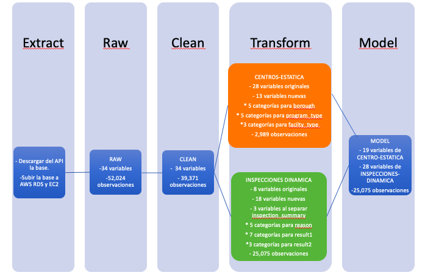
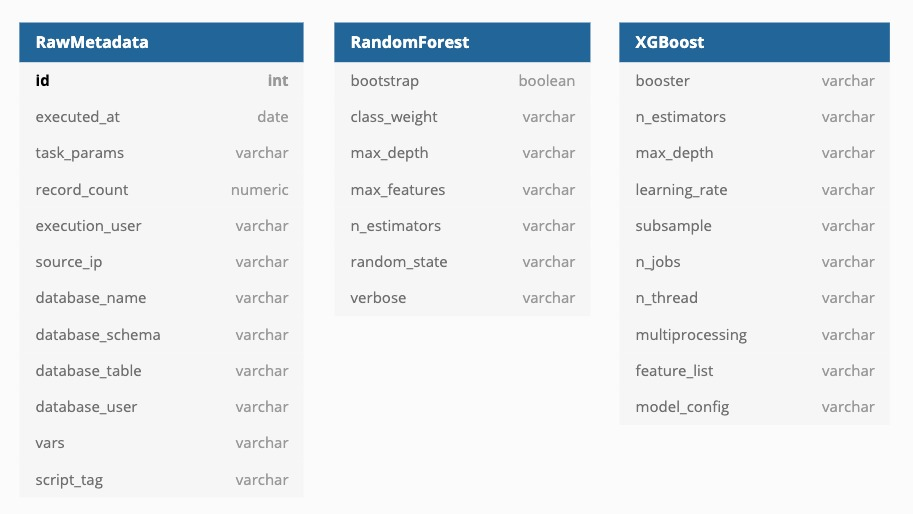

# Arquitectura de productos de datos - ITAM 2020

# NYC Open Data: DOHMH Childcare Center Inspections

En la ciudad de Nueva York se realizan inspecciones diarias en días hábiles a los 2,807 centro de cuidado infantil que hay en la ciudad. Del total de inspecciones realizadas, a partir de mayo del año 2016 y hasta el día de hoy, aproximadamente el 60% tiene algún tipo de violación. De los centros con violaciones, 51% son del tipo general, 35% críticas y 14% son un peligro para salud pública. Por lo tanto, es de vital importancia identificar cuáles centros son más propensos a cometer una violación de salud pública para llegar a inspeccionarlos en el menor tiempo posible. 

Si se tuviera suficientes inspectores para visitar todos los centros diariamente, este problea no existiría pero, dado que solamente hay un número limitado de inspectores, se diseñará e implementará un modelo predictivo que permita identificar a los centro de cuidados infantiles con mayor probabilidad de cometer una violación del tipo "peligro par ala salud pública".

El set de datos que se utilizó se encuentra en la plataforma [NYC Open Data](https://dev.socrata.com/foundry/data.cityofnewyork.us/dsg6-ifza). 

## Objetivo

El objetivo del proyecto es realizar un modelo predictivo que permita identificar a los centro de cuidados infantiles con mayor probabilidad de cometer una violación del tipo "peligro par ala salud pública".

## Datos

El set de datos que se utilizó se encuentra en la plataforma [NYC Open Data](https://dev.socrata.com/foundry/data.cityofnewyork.us/dsg6-ifza) y contiene una lista de todas las inspecciones que se realizaron a partir del 26 de mayo del 2016 y hasta el día de hoy. La base de datos se actualiza de manera diaria y contiene información sobre 24 varibales y hasta el 28 de abril del 2020 52,000 observaciones con duplicados y 40,000 sin duplicados.

Las variables pueden clasificarse en los siguientes rubros:

No obstante, de la base original, nosotros solamente utilizamos las siguientes variables. Las demás variables utilizadas en nuestro modelo fueron creadas y su descripción puede encontrar en:

## Extracción y carga de los datos

El set de datos que utilizamos se encuentra en un API REST en la plataforma [NYC Open Data](https://dev.socrata.com/foundry/data.cityofnewyork.us/dsg6-ifza), que permite descargar los datos en formato `csv`, `xml` y `json`.

> Se decidió utilizar el formato `json` para evitar conflictos con comas, comillas dobles, o cualquier otro error de <em>parseo</em> que pudiera surgir si utilizáramos `csv`. (`xml` no estaba en la jugada).

La **extracción** y **carga** (<em>extract</em> y <em>loading</em>) de los datos se detalla a continuación.

### Cron con Luigi
Los datos de DOHMH Childcare Center Inspections se actualizan diaramente. Esto nos permite automatizar fácilemente el proceso de extracción, transformación y carga de datos. 

Dado que usaremos un servidor Ubuntu, podemos hacer uso de [Cron](https://en.wikipedia.org/wiki/Cron), el <em>job scheduler</em> por excelencia de sistemas UNIX. 

La rutina que programemos en Cron ejecutará un script de Python que realice lo siguiente:
1. Extrear los nuevos datos del endpoint del API.
2. Ejecutar los `INSERTS` en nuestro esquema de Postgres
3. Enviar notificación por correo a nuestro equipo cuando el script haya finalizado.

Nuestro `crontab` lucirá de la siguiente manera:

**Nota: Los nombres de archivos y directorios no son finales.**

**Contenido de nuestroo `crontab`**
~~~
MAILTO=miembros-equipo-5@dpa-itam-2020.com
0 10 * * * python3 /home/ubuntu/scripts/etl/execute.sh
~~~

### ETL con Luigi
El ETL está en [este otro repositorio](https://github.com/dpa-2020-equipo-5/nyc-ccci-etl) para tratarlo como una unidad <em>deployable</em> independiente.

Para ejeuctar el orquestador:

~~~~bash
ssh usuario@18.208.188.16
/home/ubuntu/nyc-ccci-etl/bin/run 2020 01 01
~~~~

El comando anterior ejecuta el script `run` con los argumentos 2020, 01 y 01. El run.sh se ve así:

~~~~bash
cd /home/ubuntu/nyc-ccci-etl
PYTHONPATH='.' luigi --module nyc_ccci_etl.luigi_tasks.load_task LoadTask --year=$1 --month=$2 --day=$3  --local-scheduler
~~~~

TODO: Orquestar con CRON

## Linaje de datos

El proceso de limpieza de datos y creación de varibles es el siguiente:

* Tabla 1 (Raw): Es la base de datos como se extrajo de la API.
* Tabla 2 (Clean): Es la base original pero limpia: 1. sin observaciones duplicadas, 2. sin espacios extras, 3. con el texto en minúsculas.
* Tabla 3 (Centros-estática): Contiene toda la información estática sobre los 2,807 centros registrados. Es decir, desde `center_name` hasta `avg_critical_violation_rate`.
* Tabla 4 (Inspecciones-dinámicas): Contiene todas las inspecciones realizadas 
* Tabla 5 (Centros-inspecciones-modelado): Contiene la información conjunta de los centros y de las inspecciones que se va a ocupar en el modelo final.
    
 **ACTUALIZAR TABLA**

## Feature engineering 

El feature engineering de la Tabla 4 (Inpecciones-dinámicas) consistió en los siguientes pasos:

* Conservar únicamente las varibales que aportaban información sobre las inspecciones (con la excepeción de borough): `daycareid`, `inspection_date`, `inspection_summary`, `violation_category` y `borough`.
* Separar la variable de `inspecion_summary` en 3: `reason`, `result1` y `result2`.
* Tirar todas las observaciones que representaran inspecciones que no fueran de primera vez (revisiones subsecuentes y especiales). Es decir, que en la variable de reason dijera "initial annual inspection". 
* Tirar las observaciones de los días no hábiles: sábado y domingo. Esto porque hay muy pocas y no son inspecciones rutinarias.
* Rellenar con NA las celdas vacías de violation_category'.
* Ordenar la base por `childcare_id` y por `inspecion_date`. (Checar si se pueden ordenar por año o hay que crear, año, mes día).
* Categorizar la variable `borough`.
* Cración de varibles:
  * `violacion`: Dummy =1 si huvo violación.
  * `public_hazard`: Dummy =1 si hubo violación y es un problema de salud pública.
  * `ultima_inspección`: Días que han pasado desde la última inspección anual.
  * `violaciones_anteriores_salud_publica`: Número de violaciones de salud pública históricas anteriores (2016-2019). 
  * `violaciones_anteriores_criticas`: Número de violaciones críticas históricas anteriores (2016-2019). 
  * `violaciones_presentes_salud_publica`: Número de violaciones de salud pública en el presente año.
  * `violaciones_presentes_criticas`: Número de violaciones críticas en el presente año.
  * `prom_violaciones_histórico_borough`: Promedio de violaciones históricas por distrito.
  * `prom_violaciones_presentes_borough`: Promedio de violaciones presentes por distrito.
  * `

El feature engineering de la Tabla 5 (Centros-inspecciones-modelado) consistió en los siguientes pasos:

## Tablas de metadatos

## Modelado

La varible binaria dependiente es `public_hazard` pues queremos predecir cuáles centros tienen mayor probabilidad de cometer una violación de salud pública.

Se corrieorn dos modelos:

 - Temporal cross-validation.
 - XGboost
## Implicaciones éticas
