# Arquitectura de productos de datos - ITAM 2020

# NYC Open Data: DOHMH Childcare Center Inspections

El objetivo del proyecto es realizar un modelo predictivo que permita identificar a los centros de cuidados infantiles de la ciudad de Nueva York con mayor probabilidad de cometer una violación del tipo "peligro para la salud pública".

## Tabla de contenido

1. [Introducción](#1.-Introducción)
2. [Estructura del repositorio](#2.Estructura-del-repositorio)
3. [Requerimientos de infraestructura](#3.-Requerimientos-de-infraestructura)
4. [Datos](#4.-Datos)
5. [Análisis exploratorio](#5.-Análisis-exploratorio)
6. [Feature engineering](#6.-Feature-engineering)
7. [Modelado](#7.-Modelado)
8. [Metadata y linaje de los datos](#8.-Metadata-y-linaje-de-los-datos)
9. [Pruebas unitarias](#9.-Pruebas-unitarias)
10. [DAG](#10.-DAG)
11. [Sesgo y equidad](#11.-Sesgo-y-equidad)
12. [Implicaciones éticas](#12.-Implicaciones-éticas)
13. [API](#13.-API)
14. [Dashboard](#14.-Dashboard)
15. [Conclusiones](#15.-Conclusiones)

## 1. Introducción

En la ciudad de Nueva York se realizan inspecciones diarias en días hábiles a los 2,807 centros de cuidado infantil que hay en la ciudad. Del total de inspecciones realizadas, a partir del abril del año 2017 y hasta el día de hoy, aproximadamente el 60% tiene algún tipo de violación. De los centros con violaciones, 51% son del tipo general, 35% críticas y 14% son un peligro para salud pública. Por lo tanto, es de vital importancia identificar cuáles centros son más propensos a cometer una violación de salud pública para llegar a inspeccionarlos en el menor tiempo posible. 

Si se tuvieran suficientes inspectores para visitar todos los centros diariamente, este problema no existiría, pero dado que solamente hay un número limitado de inspectores, se diseñará e implementará un modelo predictivo que permita identificar a los centro de cuidados infantiles con mayor probabilidad de cometer una violación del tipo "peligro para la salud pública".

El set de datos que se utilizó se encuentra en la plataforma [NYC Open Data](https://dev.socrata.com/foundry/data.cityofnewyork.us/dsg6-ifza). 

## 2. Estructura del repositorio.

La estructura del repositorio es la siguiente:

- Carpeta [config](https://github.com/dpa-2020-equipo-5/dpa-2020/blob/master/config): Contiene los scripts necesarios para crear la arquitectura en la n

- Carpeta [eda](https://github.com/dpa-2020-equipo-5/dpa-2020/blob/master/eda): Contiene el notebook e imágenes correspondientes al análisis exploratorio de los datos.

- Carpeta [img](https://github.com/dpa-2020-equipo-5/dpa-2020/blob/master/r/img): Contiene las imágenes y diagramas utilizados en este `README.md`.

- Carpeta [scripts](https://github.com/dpa-2020-equipo-5/dpa-2020/blob/master/scripts): Contiene los scripts necesarios para poder correr los modelos.

     1. [clean.py](https://github.com/dpa-2020-equipo-5/dpa-2020/blob/master/scripts/clean.py): Script que ayuda a realizar la limpieza de los datos.
     2. [centros_estatica_proc.py](https://github.com/dpa-2020-equipo-5/dpa-2020/blob/master/scripts/centros_estatica_proc.py): Script que hace el feature engineering de la información correspondiente a los centros de cuidado infantil.
     3. [inspecciones_dinamica_proc.py](https://github.com/dpa-2020-equipo-5/dpa-2020/blob/master/scripts/inspecciones_dinamica_proc.py): Script que hace el feature engineering de la información correspondiente a las inspecciones realizadas a los centros de cuidado infantil.  
     4. [entrenamiento.py](https://github.com/dpa-2020-equipo-5/dpa-2020/blob/master/scripts/entrenamiento.py): Script que une la información de `centros_estatica_proc.py` y `inspecciones_dinamica_proc.py` y con eso,  realiza la división de los datos en la muestra para entrenamiento y para validación.
     5. [randomforest.py](https://github.com/dpa-2020-equipo-5/dpa-2020/blob/master/scripts/randomforest.py) : Script que realiza un modelo de randomforest.
     

## 3. Requerimientos de infraestructura

### 3.1. Creación de arquitectura en la nube

#### 3.1.1 Prerrequisitos

- [Instalar jq](https://stedolan.github.io/jq/download/)

- [Instalar python 3.6+](https://www.python.org/downloads/)

- [Instalar AWS CLI](https://docs.aws.amazon.com/cli/latest/userguide/cli-chap-getting-set-up.html)

- [Instalar Boto3 library](https://pypi.org/project/boto3/)

- [Configurar tus credenciales de AWS](https://docs.aws.amazon.com/cli/latest/userguide/cli-chap-configure.html)

#### 3.1.2 Configuración

1) Primero hay que ir al directorio [config](https://github.com/dpa-2020-equipo-5/dpa-2020/blob/master/config)
2) Segundo, hay que correr el script ./run.sh

El script crea toda la arquitectura necesaria en AWS para realizar las operaciones de ETL y predicción. 

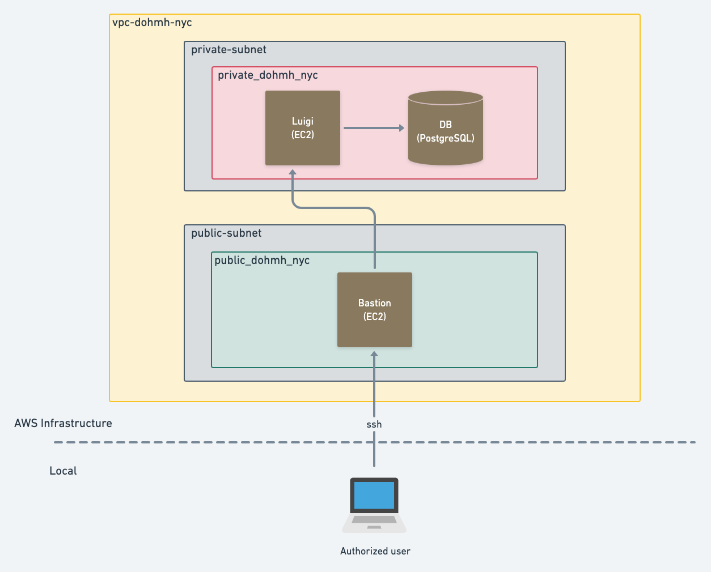

### 3.2 Extracción y carga de los datos

El set de datos que utilizamos se encuentra en un API REST en la plataforma [NYC Open Data](https://dev.socrata.com/foundry/data.cityofnewyork.us/dsg6-ifza), que permite descargar los datos en formato `csv`, `xml` y `json`.

> Se decidió utilizar el formato `json` para evitar conflictos con comas, comillas dobles, o cualquier otro error de <em>parseo</em> que pudiera surgir si utilizáramos `csv`. (`xml` no estaba en la jugada).

La **extracción** y **carga** (<em>extract</em> y <em>loading</em>) de los datos se detalla a continuación.

#### 3.2.1 Cron con Luigi

Los datos de DOHMH Childcare Center Inspections se actualizan diaramente. Esto nos permite automatizar fácilemente el proceso de extracción, transformación y carga de datos. 

Dado que usaremos un servidor Ubuntu, podemos hacer uso de [Cron](https://en.wikipedia.org/wiki/Cron), el <em>job scheduler</em> por excelencia de sistemas UNIX. 

La rutina que programemos en Cron ejecutará un script de Python que realice lo siguiente:
1. Extraer los nuevos datos del endpoint del API.
2. Ejecutar los `INSERTS` en nuestro esquema de Postgres
3. Enviar notificación por correo a nuestro equipo cuando el script haya finalizado.

Nuestro `crontab` lucirá de la siguiente manera:

**Nota: Los nombres de archivos y directorios no son finales.**

**Contenido de nuestro `crontab`**
~~~
MAILTO=miembros-equipo-5@dpa-itam-2020.com
0 10 * * * python3 /home/ubuntu/scripts/etl/execute.sh
~~~

#### 3.2.2 ETL con Luigi
El ETL está en [este otro repositorio](https://github.com/dpa-2020-equipo-5/nyc-ccci-etl) para tratarlo como una unidad <em>deployable</em> independiente.

Para ejeuctar el orquestador:

~~~~bash
ssh usuario@18.208.188.16
/home/ubuntu/nyc-ccci-etl/bin/run 2020 01 01
~~~~

El comando anterior ejecuta el script `run` con los argumentos 2020, 01 y 01. El run.sh se ve así:

~~~~bash
cd /home/ubuntu/nyc-ccci-etl
PYTHONPATH='.' luigi --module nyc_ccci_etl.luigi_tasks.load_task LoadTask --year=$1 --month=$2 --day=$3  --local-scheduler
~~~~

TODO: Orquestar con CRON

## 4. Datos

El set de datos que se utilizó se encuentra en la plataforma [NYC Open Data](https://dev.socrata.com/foundry/data.cityofnewyork.us/dsg6-ifza) y contiene una lista de todas las inspecciones que se realizaron a partir de abril del 2017 y hasta el día de hoy. La base de datos se actualiza de manera diaria y contiene 34 variables con alrededor de 51,000 observaciones incluyendo observaciones duplicadas. Si se elimina las observaciones duplicadas, quedan alrededor de 39,000 inspecciones.

Las variables, su tipo y descripción son las siguientes:

| Variable                              | Tipo   | Descripcion                                                                                                                                                                                                                                                                                                                                          |
|---------------------------------------|--------|------------------------------------------------------------------------------------------------------------------------------------------------------------------------------------------------------------------------------------------------------------------------------------------------------------------------------------------------------|
| centername                            | text   | This is the Legal name of the Entity that permits the Child Care Center                                                                                                                                                                                                                                                                              |
| legalname                             | text   | This is the name of the Child Care Center as known to the public (DBA)                                                                                                                                                                                                                                                                               |
| building                              | text   | Building portion of the address.                                                                                                                                                                                                                                                                                                                     |
| street                                | text   | Street portion of the address.                                                                                                                                                                                                                                                                                                                       |
| borough                               | text   | Borough as per the address of the entity                                                                                                                                                                                                                                                                                                             |
| zipcode                               | text   | Zip code as per the address of the entity                                                                                                                                                                                                                                                                                                            |
| phone                                 | text   | Phone Number                                                                                                                                                                                                                                                                                                                                         |
| permitnumber                          | text   | This is the Permit Number of a Child Care or a Camp. This number is not required for a School Based Child Care or After School Program.                                                                                                                                                                                                              |
| permitexp                             | date   | This field represents the date a permit expired. All Group Child Care Centers (GDC) are permitted for 2 years and Camps for one. (All camps expire automatically on Sept. 15 of the year they opened).                                                                                                                                               |
| status                                | text   | SBCC: 'Active''; GDC & Camp: 'Permitted', 'Expired-In Renewal', 'Permit Suspended'; SMPG: 'Registered'. There are other statuses, such as Pending (prior to operational status) and OOB (Out of Business), but data are available only for currently operating child care facilities.                                                                |
| agerange                              | text   | This field represents the possible age range of children in the program.                                                                                                                                                                                                                                                                             |
| maximumcapacity                       | number | The maximum number of children the facility is allowed, based on the square footage of class and play rooms, the number of toilets and sinks, and overall estimates from the NYC Department of Buildings. Enrollment can be higher than the maximum capacity if there are part-time programs.                                                        |
| dc_id                                 | text   | Unique DOHMH ID                                                                                                                                                                                                                                                                                                                                      |
| programtype                           | text   | Program Type - Infant Toddler, Preschool, After School, Preschool Camp, School Age Camp, All Age Camp                                                                                                                                                                                                                                                |
| facilitytype                          | text   | Facility Type: FDC  - Family Day Care (State licensed),  GFDC - Group Family Day Care (State Licensed), SBCC - School Base Child Care (Licensed by NYS, DOE, Charter School or Regents), Camp, SMPG - Summer Program (NYS or NYC licensed), GDC - Group Day Care (NYC DOHMH Permitted), SACC - School Age Child Care (After School - State Licensed) |
| childcaretype                         | text   | Group Child Care (GCC) facilities are one of 2 program types: Preschool or Infant/Toddler. All GCC citywide statistics are calculated by type.                                                                                                                                                                                                       |
| bin                                   | text   | Building Identification Number assigned by the NYC  Department of Buildings to the building where the facility is located. If the last 6 digits are '0' then the address was not geocoded and the first digit designates the borough.                                                                                                                |
| url                                   | text   | Website for the child care center.                                                                                                                                                                                                                                                                                                                   |
| datepermitted                         | date   | Estimated date that the site was originally permitted, used to calculate the age of the program. See Actual field for additional information.                                                                                                                                                                                                        |
| actual                                | text   | Flag for correct (actual) date of original permit. Some programs pre-date the current DOHMH systems and do not have record of their original permit date. 'Y' indicates that the actual date is available, while 'N' indicates that the program was originally permitted sometime before the DatePermitted.                                          |
| violationratepercent                  | number | Percent of Initial Inspections that resulted in at least one Critical or Public Health Hazard (PHH) violation                                                                                                                                                                                                                                        |
| violationavgratepercent               | number | Citywide average violation rate calculated as percent of Initial Inspections that ended with a Critical or PHH (Public Health Hazard) violation for a specific Child Care Type. Compare with Violation Rate to see if above or below it peers for a Child Care Type                                                                                  |
| totaleducationalworkers               | number | Current number of Educational Staff in the program, including teachers, assistant teachers, teacher directors and education directors. Note that staff data are updated only upon inspection and may be outdated.                                                                                                                                    |
| averagetotaleducationalworkers        | number | Citywide average total number of Educational Staff in the program - includes teachers, assistant teachers and non administrative directors for a Child Care Type                                                                                                                                                                                     |
| publichealthhazardviolationrate       | number | Percent of Public Health Hazard violations among all violations issued at initial inspections during the past 3 years. If the same violation is cited multiple times during one inspection, it is counted only once.                                                                                                                                 |
| averagepublichealthhazardiolationrate | number | Citywide average number of PHH (Public Health Hazard) violation categories over 3 years for a Child Care Type.                                                                                                                                                                                                                                       |
| criticalviolationrate                 | number | Percent of Critical violations among all violations issued at initial inspections during the past 3 years. If the same violation is cited multiple times during one inspection, it is counted only once.                                                                                                                                             |
| avgcriticalviolationrate              | number | Citywide average number of Critical violation categories over 3 years for a Child Care Type.                                                                                                                                                                                                                                                         |
| inspectiondate                        | date   | Inspection Date                                                                                                                                                                                                                                                                                                                                      |
| regulationsummary                     | text   | Violation Description Language                                                                                                                                                                                                                                                                                                                       |
| violationcategory                     | text   | Violation Category - Public Health Hazard (violation needs to be fixed within 1 day),  Critical (Violation needs to be fixed within 2 weeks), General (Violation needs to be fixed in 30 days)                                                                                                                                                       |
| healthcodesubsection                  | text   | Health Code Sub Section                                                                                                                                                                                                                                                                                                                              |
| violationstatus                       | text   | Violation Status - OPEN; CORRECTED; MORE INFO; or N/A                                                                                                                                                                                                                                                                                                |
| inspectionsummaryresult               | text   | The summary result of the inspection, based on the type of inspection and the number and types of violations.                                                                                                                                                                                                                                        |

No obstante, de la base original, se utilizaron muy pocas variables ya que la mayoría son tipo texto. Las demás variables utilizadas en nuestro modelo fueron creadas y su descripción puede encontrar en la sección 6.Feature engineering.

## 5. Análisis exploratorio

El análisis exploratorio de nuestros datos básicamente consistió en analizar la frecuencia y el promedio de inspecciones por año y por distrito para conocer dónde y cuándo había más violaciones, así como conocer con cuántos inspectores se cuenta en promedio diario para poder realizar las inspecciones futuras.

El análisis se hizo para un total de 38,519 observaciones que surgieron después de tirar los duplicados de la base de datos. Dado que este análisis es estático y la actualización de los datos es diaria, los números pueden variar en el tiempo.

### 5.1 Inspecciones totales anuales

La siguiente tabla muestra el número de inspecciones anuales totales por distrito:

|       |       |          |  Distrito |        |               |       |
|:-----:|:-----:|:--------:|:---------:|:------:|:-------------:|:-----:|
|  Año  | bronx | brooklyn | manhattan | queens | staten_island | Total |
|  2017 |  1042 |   2576   |    1349   |  1673  |      274      |  6914 |
|  2018 |  3088 |   4251   |    3386   |  3225  |      630      | 14580 |
|  2019 |  2910 |   4130   |    2627   |  3071  |      519      | 13257 |
|  2020 |  998  |   1063   |    759    |   780  |      111      |  3711 |
| Total |  8038 |   12020  |    8121   |  8749  |      1534     | 38462 |

**Nota:** El total suma 38,462 porque hay 57 observaciones que no tienen año de inspección.

Se puede observar que el número de inspecciones para el año 2018 y 2019 fue de entre 13,000 y 15,000 inspecciones. El año 2020 tiene menos inspecciones porque apenas está transcurriendo y porque muchos centros se han cerrado por la situación del COVID. El año 2017 también tiene menos inspeccione y la razón puede deberse más bien al inicio de la recolección de datos y no tanto a que el número de inspecciones se haya duplicado de un año para otro.

Además, se muestra que 3 de los 5 distritos han tenido alrededor de 8,000-9,000 inspecciones. Sin embargo, Brooklyn ha tenido casi 1/3 más y Staten Island 6/8 menos. Esto puede deberse a que esos distritos tengan más o menos violaciones y por eso si inspeccionen más/menos o al número de centros por distrito. Por ello, la siguiente gráfica muestra el número de centros por distrito.

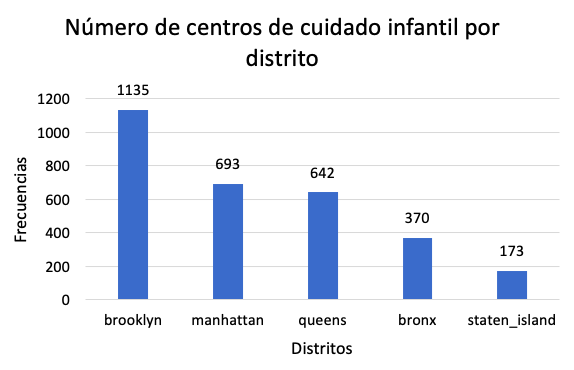

De la gráfica se observa que, efectivamente, Brooklyn tiene más inspecciones y Staten Island menos por el número de centros que tiene cada distrito. Sin embargo, llama la atención el caso de Bronx pues, aunque solamente tiene 370 centros, éstos son inspeccionados tantas veces como Manhattan y Queens que tienen el doble de centros. Esto puede ser un indicador de que en el distrito de Bronx se cometen más violaciones. 

Finalmente, se construyó una tabla con el número de violaciones por año para ver cuántas inspecciones resultaban en violaciones y de qué tipo.

|       |         | Tipo de violación  |                      |       |
|:-----:|:-------:|:------------------:|:--------------------:|:-----:|
|  Año  | general |      critical      | public_health_hazard | Total |
|  2017 |   1846  |        1973        |          828         |  4647 |
|  2018 |   5019  |        2841        |         1174         |  9034 |
|  2019 |   3994  |        2399        |         1004         |  7397 |
|  2020 |   1051  |         847        |          275         |  2173 |
| Total |  11910  |        8060        |         3281         | 23251 |

Se observa que, del número de inspecciones realizadas, aproximadamente el 60% tiene algún tipo de violación. Esto puede significar o que muchísimos centros comenten violaciones o que se está inspeccionando de una manera adecuada y se está descubriendo a los centros que van a cometer violaciones efectivamente. De los centros con violaciones, 51% son del tipo general, 35% críticas y 14% son un peligro para salud pública.

### 5.2 Inspecciones promedio diarias

Como no se cuenta con información acerca de cuántos inspectores hay disponibles por día, se crearon tablas del promedio de inspecciones diarias por año y por distrito para conocer el número mínimo de inspectores disponibles. 

|      |       |          |  Distrito |        |               |       |
|:----:|:-----:|:--------:|:---------:|:------:|:-------------:|:-----:|
|  Año | bronx | brooklyn | manhattan | queens | staten_island | Total |
| 2017 |   7   |    17    |     9     |   11   |       2       |   46  |
| 2018 |   13  |    17    |     14    |   13   |       3       |   60  |
| 2019 |   11  |    16    |     10    |   12   |       2       |   51  |
| 2020 |   18  |    20    |     14    |   14   |       2       |   68  |

Se observa que se cuenta con entre 46 y 68 inspectores de manera diaria para visitar centros. En el 2020, había 68 inspecciones diarias y eso implica que el departamento de inspecciones cuenta con al menos 68 inspectores para las visitas futuras en el año, claro, suponiendo que se sigue contando con el mismo personal disponible. Los promedios de inspecciones diarias por distrito son: Bronx 12, Brooklyn 18, Manhattan 12, Queens 12 y Staten Island.

### 5.3 Inspecciones promedio diarias para el tipo inspección inicial

Finalmente, se calculó el promedio de inspecciones diarias de tipo inspección inicial dado que en este modelo las predicciones se crearán para inspecciones iniciales. La razón es que las inspecciones subsecuentes no son de tanto interés pues ya son solo follow-ups, lo importante es identificar a los centros con violaciones en sus inspecciones iniciales.

|      |       |          |  Distrito |        |               |       |
|:----:|:-----:|:--------:|:---------:|:------:|:-------------:|:-----:|
|  Año | bronx | brooklyn | manhattan | queens | staten_island | Total |
| 2017 |   3   |     8    |     4     |    5   |       1       |   21  |
| 2018 |   6   |     8    |     7     |    6   |       1       |   28  |
| 2019 |   6   |     8    |     5     |    6   |       1       |   26  |
| 2020 |   9   |    10    |     7     |    7   |       1       |   34  |

El promedio diario del número de inspecciones iniciales es de entre 21 y 34 representando aproximadamente la mitad del total de inspecciones diarias, incluyendo subsecuentes y especiales. Es decir, de todas las inspecciones que se hacen de forma diaria, la mitad son inspecciones de primera vez. En el 2020, se contaba en promedio con 34 inspectores para hacer visitas iniciales por lo que las predicciones deben generarse para por lo menos 34 centros. 

## 6. Feature engineering

El proceso de limpieza de datos y creación de variables es el siguiente:

* Tabla 1 (Raw): Es la base de datos como se extrajo de la API.
* Tabla 2 (Clean): Es la base original pero limpia: 1. sin observaciones duplicadas, 2. sin espacios extras, 3. con el texto en minúsculas. El script correspondiente se llama `clean.py`.
* Tabla 3 (Centros-estática): Contiene toda la información estática sobre los 2,989 centros registrados. El script que genera esta tabla es `centros_estática_proc.py`.
* Tabla 4 (Inspecciones-dinámicas): Contiene todas las inspecciones realizadas desde el abril del 2017 al día de hoy. El script que genera esta tabla es `inspecciones_dinámicas_proc.py`.
* Tabla 5 (Centros-inspecciones-modelado): Contiene la información conjunta de los centros y de las inspecciones que se ocupa en la sección de modelado. El script correspondiente se llama `entrenamiento.py`.

**NOTA**: El número de observaciones y variables que se muestra en el siguiente diagrama corresponde a la información obtenida una vez que se corre el script correspondiente a cada tabla. 

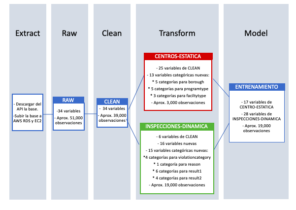

### 6.1 Tabla 3: Centros-estática  

El feature engineering que se le aplicó a la Tabla 3 (Centros-estática) consistió en los siguientes pasos:

* Usar las 28 variables originales de la Tabla2 que fueron seleccionadas para la Tabla3. Es decir, desde `centername` hasta `avgcriticalviolationrate`. 
* Categorizar las variables: `borough`, `programtype` y `facilitytype`.

### 6.2 Tabla 4: Inspecciones-dinámicas  

El feature engineering que se le aplicó a la Tabla 4 (Inspecciones-dinámicas) consistió en los siguientes pasos:

* Conservar únicamente 8 variables: 6 variables que aportan información sobre las inspecciones `dc_id`, `inspectiondate`, `regulationsummary`, `violationcategory`, `healthcodesubsection`, `violationstatus`, `inspectionsummaryresult`;`borough`, que se usa para generar nuevas variables, y 'dcare_id, que se usa para hacer el join): 
* Separar la variable de `inspecionsummaryresult` en 3 variables: `reason`, `result1` y `result2`. 
* Rellenar con NP las celdas vacías de `violationcategory`.
* Categorizar las variables `violationcategory`, `reason`, `result1` y `result2`.
* Tirar todas las observaciones que representaran inspecciones que no fueran de primera vez (revisiones subsecuentes y especiales). Es decir, que en la variable de `reason` dijera "initial annual inspection".  
* Tirar las observaciones de los días no hábiles: sábado y domingo. Esto porque hay muy pocas y no son inspecciones rutinarias.
* Ordenar la base por `dc_id` y por `year`, `month` y `day` en orden descendiente.
* Creación de variables:
  * `inspection_year`: Año de la inspección.
  * `inspection_month`: Mes de la inspección.
  * `inspection_day_name`: Día de la inspección.
  * `dias_ultima_inspeccion`: Días que han pasado desde la última inspección anual.
  * `violaciones_hist_salud_publica`: Número de violaciones de salud pública históricas (2017-2019) por centro. 
  * `violaciones_2019_salud_publica`: Número de violaciones de salud pública en el 2019 por centro.
  * `violaciones_hist_criticas`: Número de violaciones críticas históricas anteriores (2017-2019) por centro.
  * `violaciones_2019_criticas`: Número de violaciones críticas en el 2019 por centro.
  * `ratio_violaciones_hist`: Número de inspecciones en total de primera vez que resultaron en violación crítica o de salud 
                              pública/ número de inspecciones de primera vez por centro.
  * `ratio_violaciones_2019`: Número de inspecciones en total de primera vez que resultaron en violación crítica o de salud 
                              pública en el 2019/ número de inspecciones de primera vez por centro.
  * `prom_violaciones_hist_borough`: Promedio de violaciones históricas por distrito.
  * `prom_violaciones_2019_borough`: Promedio de violaciones en el 2019 por distrito.
  * `ratio_violaciones_hist_sp`: Número de violaciones de salud pública de primera vez por centro históricas (2017-2019)/ 
                                      número de violaciones de primera vez de todo tipo por centro históricas (2017-2019) .
  * `ratio_violaciones_2019_sp`: Número de violaciones de salud pública de primera vez por centro en el 2019 / número de   
                                 violaciones de primera vez de todo tipo por centro en el 2019 .
  * `ratio_violaciones_hist_criticas`: Número de violaciones críticas de primera vez por centro históricas (2017-2019)/ 
                                      número de violaciones de primera vez de todo tipo por centro históricas (2017-2019).
  * `ratio_violaciones_2019_criticas`: Número de violaciones críticas de primera vez por centro en el 2019/ número de 
                                       violaciones de primera vez de todo tipo por centro en el 2019.

### 6.3 Tabla 5: Centros-inspecciones-modelado

* De la Tabla 3 (Centros-estática) conservar únicamente 17 variables que se utilizarán en el modelo: `dc_id`, `maximumcapacity`, `totaleducationalworkers`, `averagetotaleducationalworkers`, `programtype_all_age_camp`, `programtype_infant_toddler`,`programtype_preschool`,`programtype_preschool_camp`, `programtype_school_age_camp`,`facilitytype_camp`,`facilitytype_gdc`,`facilitytype_sbcc`,`borough_bronx`,`borough_brooklyn`,`borough_manhattan`,`borough_queens` y `borough_staten_island`.
* De la Tabla 4 (Inspecciones-dinámicas) conservar únicamente las 29 variables que se utilizarán en el modelo: `result_1_passed_inspection`, `result_1_passed_inspection_with_no_violations`, `result_1_previously_cited_violations_corrected`, `result_1_previously_closed_program_re-opened`, `result_1_reinspection_not_required`, `result_1_reinspection_required`,`result_2_NR`, `result_2_fines_pending`, `result_2_program_closed`, `result_2_violations_corrected_at_time_of_inspection`, `inspection_year`, `inspection_month`, `inspection_day_name`, `violationcategory_critical`, `violationcategory_general`, `violationcategory_public_health_hazard`, `dias_ultima_inspeccion`, `violaciones_hist_salud_publica`, `violaciones_2019_salud_publica`    , `violaciones_hist_criticas`, `violaciones_2019_criticas`, `ratio_violaciones_hist`, `ratio_violaciones_2019`, `prom_violaciones_hist_borough`, `prom_violaciones_2019_borough`, `ratio_violaciones_hist_sp`, `ratio_violaciones_2019_sp`                , `ratio_violaciones_hist_criticas`, `ratio_violaciones_2019_criticas`.
* Dividir los datos en la muestra de entrenamiento que corresponde a todas las inspecciones entre el año 2017 y noviembre del 2019 y en la muestra de validación que corresponde a los datos de diciembre del 2019.

## 7. Modelado

La variable binaria dependiente es `violationcategory_public_health_hazard` pues se desea predecir cuáles centros tienen mayor probabilidad de cometer una violación de salud pública.

Se utilizaron todas las variables de la Tabla 5 descritas en la sección 6.3 Tabla 5: Centros-inspecciones-modelado.

Para el entrenamiento se usaron todos los datos desde el 2017 hasta noviembre del 2019. Para la validación se usaron los datos de diciembre del 2019 y para las predicciones los datos de enero del 2020.

Se corrió un modelo de random forest con un gridsearch para definir cuáles son los mejores parámetros.
 
### 7.1 Resultados random forest

La matriz de confusión es la siguiente:

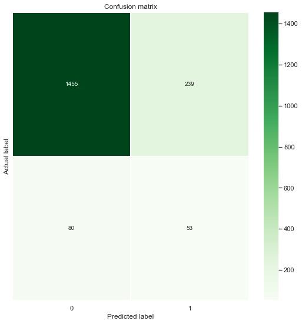

## 8. Metadata y linaje de datos

Los metadatos generados en cada paso del pipeline son:

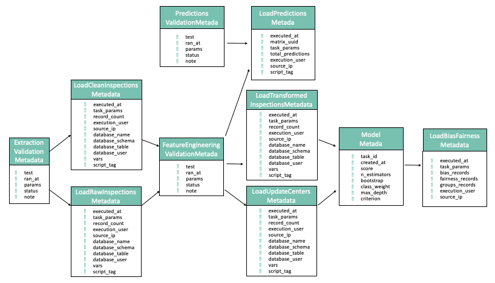

## 9. Pruebas unitarias

Actualmente nuestro pipeline cuenta con 6 pruebas unitarias (4 en Extraction y 2 en Feature Engineering):

### 9.1. Pruebas de extracción

#### 9.1.1. [Extraction Date Validation](https://github.com/dpa-2020-equipo-5/nyc-ccci-etl/blob/master/nyc_ccci_etl/luigi_tasks/extraction_validations/extraction_date_validation.py)

Verifica que la fecha de extracción solicitada sea válida y que no sea futura. El formato de la fecha utilizado es YYYY-mm-dd. Ejemplos de fechas inválidas:
* 2020-3-35
* 2019-31-2
* 2020-10-15 (la fecha 15 de oct 2020 sí existe, pero es futura y por lo tanto se considera inválida)

#### 9.1.2. [Non Empty Extraction Validation](https://github.com/dpa-2020-equipo-5/nyc-ccci-etl/blob/master/nyc_ccci_etl/luigi_tasks/extraction_validations/non_empty_extraction_validation.py)

Checa que la extracción tenga como resultado por lo menos una inspección.

#### 9.1.3. [Is JSON Validation](https://github.com/dpa-2020-equipo-5/nyc-ccci-etl/blob/master/nyc_ccci_etl/luigi_tasks/extraction_validations/is_json_validation.py)

Verifica que la extracción tenga como resultado un objeto JSON válido. Python parsea JSONs como listas de diccionarios.

#### 9.1.4. [Inspection Dates Match Request Date Validation](https://github.com/dpa-2020-equipo-5/nyc-ccci-etl/blob/master/nyc_ccci_etl/luigi_tasks/extraction_validations/inspection_dates_match_request_date_validation.py)

Analiza cada fecha de inspección del resultado de la extracción y verifica que todas estas sean iguales a la fecha de la solicitud (fecha con la que ejecuta el orquestador).

### 9.2. Pruebas de Feature Engineering

#### 9.2.1. [Columns One Hot Encoding Validation](https://github.com/dpa-2020-equipo-5/nyc-ccci-etl/blob/master/nyc_ccci_etl/luigi_tasks/feature_engineering_validations/columns_one_hot_encoding_validation.py)

Verifica que la transformación haya correctamente creado columnas necesarias con <em>One Hot Encoding</em>

#### 9.2.2. [Transformed Inspections Match Request Date Validation](https://github.com/dpa-2020-equipo-5/nyc-ccci-etl/blob/master/nyc_ccci_etl/luigi_tasks/feature_engineering_validations/transformed_inspections_match_request_date_validation.py)

Dado que nuestro orquestador trabaja con datos de un día a la vez, es necesario que las transformaciones de datos se hagan únicamente sobre los datos del día. Esto a su vez también logrará que la ejecución del pipeline sea significativamente más rápida. Esta prueba unitaria se encarga de verificar que todas las fechas de inspección de las inspecciones transformadas sean iguales a la fecha de la solicitud (fecha con la que ejecuta el orquestador).

## 10. DAG

### 10.1 DAG del modelo
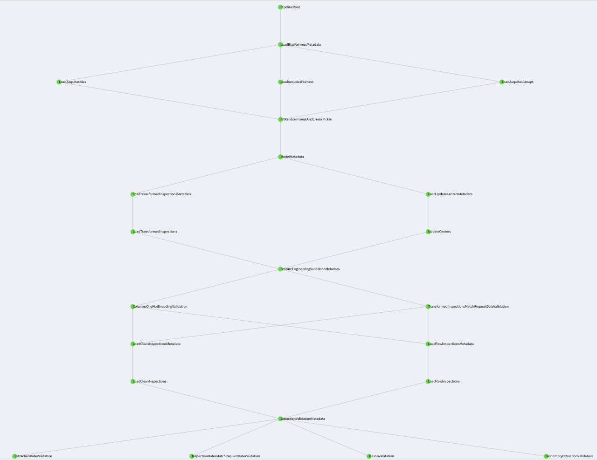

### 10.2 DAG de las predicciones
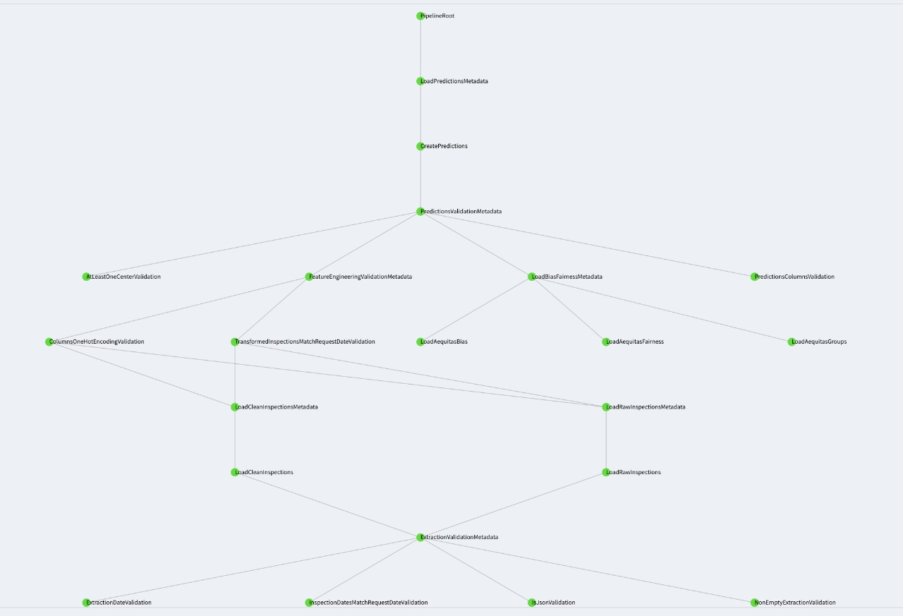

## 11. Sesgo y equidad

Es posible que los modelos de machine learning incorporen sesgos e inequidades de manera intencional o por un sobre/sub muestreo en las predicciones de los modelos. Por ello, es importante estudiar métricas de sesgo y equidad para tratar de aminorar las injusticias o, en su defecto, al menos estar consciente de los sesgos que se están creando en los resultados del modelo.

### 11.1 Métricas 

Dado que el objetivo de este trabajo es apoyar a los inspectores a identificar más prontamente a los centros de cuidados infantiles con mayor probabilidad de cometer una violación del tipo "salud pública", la intervención del modelo es asistiva. La implementación de los resultados del modelo ayudará a los inspectores a identificar violaciones y por ende a los niños pues estarán menos tiempo en riesgo. 

De esta forma, el objetivo es minimizar el error de los falsos negativos. Es decir, minimizar el riesgo de que el modelo haya predicho que un centro no iba a realizar una violación de salud pública y realmente si la haya realizado.

Por consiguiente, las dos métricas a optimizar son:

- False Negative Rate Parity.
- False Omission Rate Parity.

### 11.2 Selección de atributos

Para seleccionar los atributos protegidos se realizaron distintas gráficas de proporción de frecuencias usando la predicción y algunas variables categóricas que se consideró que pudieran tener sesgo en la clasificación.

- `borough`: El distrito es importante pues hay distintos niveles socioeconómicos entre éstos y ello puede afectar la calidad y limpieza de los centros infantiles. Además, la población por condado también es importante.
- `programtype`: Esta variable se refiere al tipo de programa del centro y está ampliamente relacionado con la edad de los niños. Esto puede ser problemático pues quizá hay mayores riesgos al atender a bebés que a niños un poco más grandes, por ejemplo.

### 11.3 Categorías de referencia

Hay que escoger una categoría de referencia para evaluar el sesgo y la justicia.

- `borough`: Escogimos la categoría de `Brooklyn` pues es el distrito con más centros y más inspecciones. Además, tiene un nivel socioeconómico bajo solamente superando al distrito de Bronx.

- `programtype`: Se escogió la categoría de `preschool` pues es el tipo de programa con más  inspecciones.

### 11.4 Resultados

#### 11.4.1 Métricas de Aequitas por default

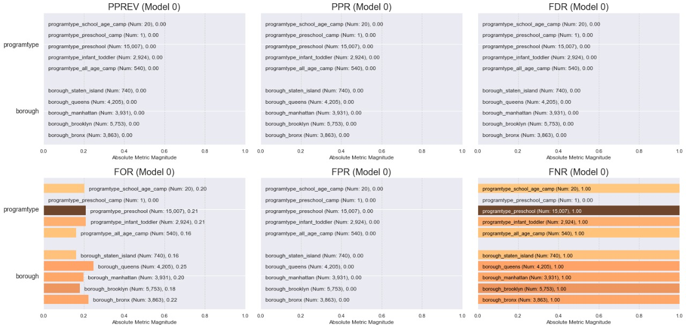

#### 11.4.2 Métricas elegidas

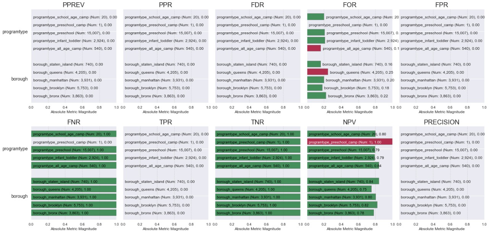

#### 11.4.3 Disparidad de métricas por distrito

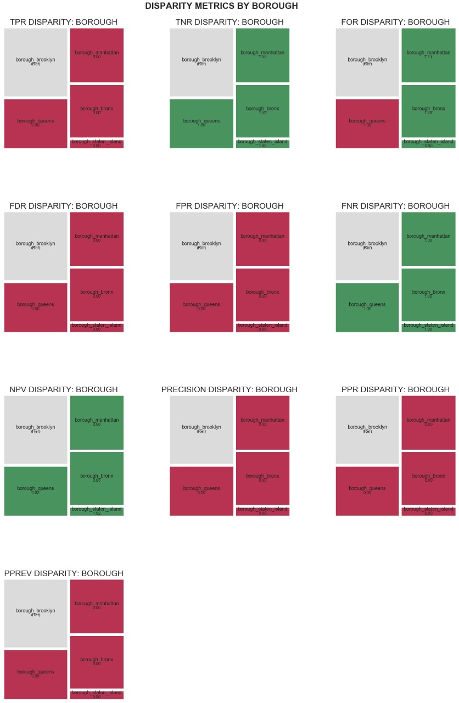

#### 11.4.4 Disparidad de métricas por tipo de programa

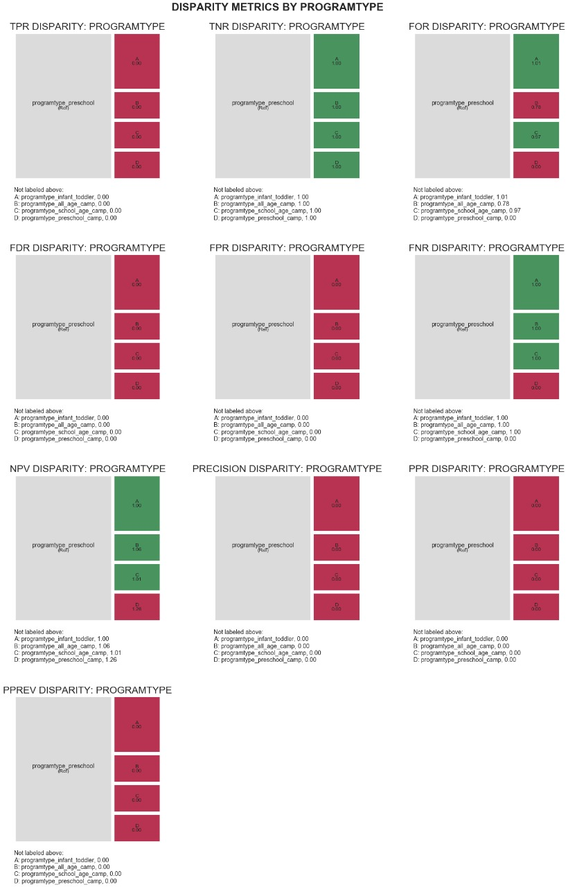

## 12. Implicaciones éticas

Algunas de las implicaciones éticas relacionadas con el modelo propuesto son las siguientes:

- Identificación del problema:

    - En este proyecto se definió como problema más grave el tener una violación de salud pública con base en la información de la variable `violationcategory` y los días que le dan al centro para arreglar el problema con base en su urgencia. Sin embargo, es probable que nuestra identificación del problema sea errónea y haya otro tipo de violaciones más urgentes o, si no, más urgentes que sucedan con más frecuencia. La decisión jerárquica de violaciones puede ser distinta en distintos contextos. 
    - Otro problema con nuestra identificación es que no se tomó en cuenta el número de niños que se ven afectados por estas violaciones. Es decir, quizá un centro comete violaciones muy graves, pero tiene poco alumnos, mientras que, otro centro pudiera estar cometiendo violaciones menos graves pero que afecten a muchos más alumnos. Para resolver este problema habría que tomar en cuenta el número de niños afectados a la hora de definir el criterio de gravedad de las violaciones.
    - Además, enfocarse a “los lugares con más violaciones” no necesariamente implica que estos lugares vayan a ser los que tienen mayor disposición o recursos para arreglar las violaciones. Es decir, quizá los centros con más violaciones ya saben que las están cometiendo, pero no tienen la forma o la disposición de arreglarlas. En cambio, quizá pueda ser más relevante visitar a los centros con mayor probabilidad de tener un cambio de conducta para así bajar el promedio de violaciones en general que es el objetivo último de estos modelos. Se he probado en otro tipo de programas sociales que éstos tienen mayor impacto en percentiles de “en medio” que los programas que se enfocan a los percentiles más bajos. Entonces, la decisión de en qué áreas utilizar los recursos y dónde podrían representar un mayor beneficio a largo plazo debe tomarse en cuenta.
    
- Otras causas de problema:

    -  El problema que estamos resolviendo podría ser, en realidad, un síntoma de un problema mayor, es decir, las violaciones en los centros podrían ser un derivado de la falta de capital humano, inseguridad, falta de estado de derecho y pobreza en la zona. Por lo tanto, incrementar el monitoreo en la zona podría no ser la solución principal si no otro tipo de actividades que mejoren la seguridad, poder adquisitivo de las personas, infraestructura de los centros, contratación de personal más adecuado, entre otros. 
    
- Datos y privacidad:
    
    - Podría existir un problema de privacidad con respecto a la publicación de los datos de las inspecciones de los centros. No se sabe si los dueños de los centros han dado su consentimiento para la publicación de los resultados de las inspecciones. Quizá debería de hacerse privado el nombre de los centros y su ubicación. 
    - El hecho de tener estos datos públicos, puede ser usado de manera incorrecta tomando represalias ante el personal y dueños de los centros si hay algún escándalo por algún problema en el centro.
     
- Acciones:

    - Un gran problema relacionado con las acciones que pueden tomarse dado los resultados del modelo es que se podría afectar negativamente a las localidades más pobres y violentas. Si se visita más a las zonas más pobres y éstas no tienen el recurso para arreglar las violaciones, se corre el riesgo del potencial cierre de centros que quizá la población necesita. Esto afectaría negativamente aún más a los padres de los niños que tienen que dejarlos en centros de cuidado infantil, afectando sus horas laborales, por ejemplo. 
    - El modelo podría generar cambios en la conducta de los encargados del centro advirtiendo a los otros centros en la zona, por ejemplo. Si suponemos que la violación de centros es por zona y un centro ya ha sido monitoreado, los demás centros pueden entrar en un estado de alerta y podrían esconder evidencia de violaciones, dado que sabrán que su “zona” es un target geográfico y será constantemente monitoreado. Esto podría representar una acción tanto positiva como negativa, positiva si se corrigen los problemas de manera más pronta y se corrigen bien, pero negativa si simplemente se esconden los problemas o se solucionan temporalmente.
    - El modelo también podría tener un efecto sobre los inspectores. Es decir, es posible que los inspectores prefieran ir a monitorear lugares "fáciles" donde no vaya a haber violaciones y donde su trabajo pueda ser más seguro y placentero. Esto puede causar incentivos perversos en los inspectores para reportar que no hubieron fallas en lugares a donde no quieren volver a ir. 
 

Por todas estas razones, es fundamental que se haga un buen scoping del problema e implementación del modelo. Es importante que el equipo reconozca las limitaciones del mismo, sus antecedentes y se involucre a expertos externos cuando sea posible para evaluar el desempeño del modelo y mejorar el monitoreo.

## 13. API

NYC DOHMH API está diseñada para obtener datos de diferentes entidades:
* Predicciones
* Inspecciones
* Parámetros del modelo
* Aequitas

Los endpoints regresan 3 diferentes tipos de códigos, de acuerdo al resultado de la petición:

* 200: petición exitosa
* 400: parámetro fecha inválido
* 404: no existen datos

## Definición de endpoints

Method | HTTP request
------------- | -------------
get_predictions | **GET** /prediction
get_predictions_by_date | **GET** /prediction/\<date>
get_inspection_by_date | **GET** /inspection/\<date>
get_model_parameter | **GET** /model_parameter
get_aequitas_bias_by_date | **GET** /aequitas/bias/\<date>
get_aequitas_fairness_by_date | **GET** /aequitas/fairness/\<date>
get_aequitas_groups_by_date | **GET** /aequitas/groups/\<date>

## Ejemplo de definición de métodos

### - **get_predictions**
> Prediction get_predictions()

Obtiene la lista de centros a verificar más reciente.
#### Request
No se necesita ningún parámetro.
#### Response

[**Prediction**](README.md#Prediction)

### - **get_predictions_by_date**
> Prediction get_predictions_by_date(date)

Obtiene una lista de centros para una fecha en específico.

#### Request

Name | Type | Description  
------------- | ------------- | -------------
 **date** | **string**| Fecha en formato yyyy-MM-dd

### Response

[**Prediction**](README.md#Prediction)

### Prediction

#### Properties
Name | Type | Description | Notes
------------ | ------------- | ------------- | -------------
**date** | **string** |  Fecha de la predicción| Formato: 'yyyy-MM-dd' 
**centers** | [**list[Inspection]**](README.md#Inspection) |  Lista de centros a inspeccionar| 

### Inspection

#### Properties
Name | Type | Description
------------ | ------------- | -------------
**center_id** | **string** | Id del centro a inspeccionar
**priority** | **integer** | Indica el orden de revisión sugerido. Entre más alto el riesgo, mayor es la prioridad. 

## 14. Dashboard

El dashboard muestra por día las predicciones hechas para todos aquellos centros con más del 50% de probabilidad de tener una violación de salud pública en orden descendente. Dado lo encontrado en el EDA, en teoría solo se necesitan las primeras 34 predicciones pues esos serán los centros a visitar. 

También se observan gráficas de barras con la ubicación por distrito de los centros predichos y el tipo de estancia infantil.

Se muestra el monitoreo del modelo con una gráfica de los verdaderos positivos y falsos negativos y finalmente, se muestran los resultados de bias y fairness.

El dashboard se encuentra en la siguiente [liga](https://ccci.dpa2020.com/) y a continuación se muestra una impresión de pantalla del mismo.

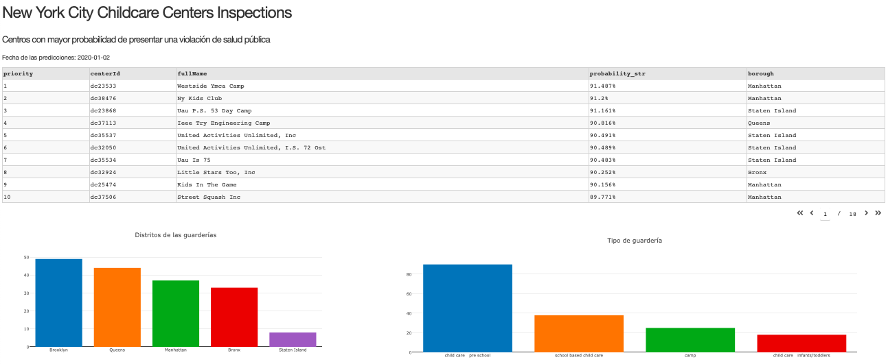

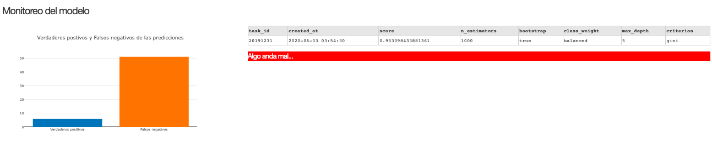

## 15. Conclusiones
