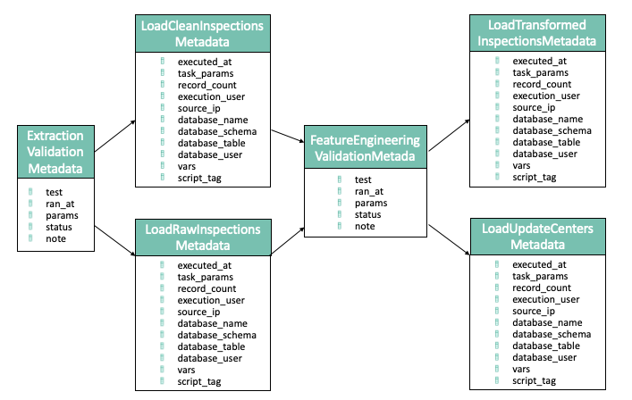
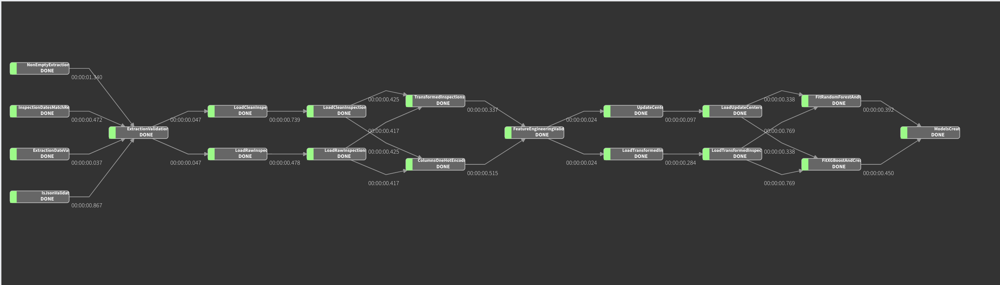

# Arquitectura de productos de datos - ITAM 2020

# NYC Open Data: DOHMH Childcare Center Inspections

El objetivo del proyecto es realizar un modelo predictivo que permita identificar a los centros de cuidados infantiles de la ciudad de Nueva York con mayor probabilidad de cometer una violación del tipo "peligro para la salud pública".

## Tabla de contenido

1. [Introducción](#1.-Introducción)
2. [Estructura del repositorio](#2.Estructura-del-repositorio)
3. [Requerimientos de infraestructura](#3.-Requerimientos-de-infraestructura)
4. [Datos](#4.-Datos)
5. [Análisis exploratorio](#5.-Análisis-exploratorio)
6. [Feature engineering](#6.-Feature-engineering)
7. [Modelado](#7.-Modelado)
8. [Metadata y linaje de los datos](#8.-Metadata-y-linaje-de-los-datos)
9. [Pruebas unitarias](#9.-Pruebas-unitarias)
10. [DAG](#10.-DAG)
11. [Sesgo y equidad](#11.-Sesgo-y-equidad)
12. [Implicaciones éticas](#12.-Implicaciones-éticas)
13. [API](#13.-API)

## 1. Introducción

En la ciudad de Nueva York se realizan inspecciones diarias en días hábiles a los 2,807 centros de cuidado infantil que hay en la ciudad. Del total de inspecciones realizadas, a partir del abril del año 2017 y hasta el día de hoy, aproximadamente el 60% tiene algún tipo de violación. De los centros con violaciones, 51% son del tipo general, 35% críticas y 14% son un peligro para salud pública. Por lo tanto, es de vital importancia identificar cuáles centros son más propensos a cometer una violación de salud pública para llegar a inspeccionarlos en el menor tiempo posible. 

Si se tuviera suficientes inspectores para visitar todos los centros diariamente, este problea no existiría pero, dado que solamente hay un número limitado de inspectores, se diseñará e implementará un modelo predictivo que permita identificar a los centro de cuidados infantiles con mayor probabilidad de cometer una violación del tipo "peligro par ala salud pública".

El set de datos que se utilizó se encuentra en la plataforma [NYC Open Data](https://dev.socrata.com/foundry/data.cityofnewyork.us/dsg6-ifza). 

## 2. Estructura del repositorio.

La estructura del repositorio es la siguiente:

- Carpeta [config](https://github.com/dpa-2020-equipo-5/dpa-2020/blob/master/config): Contiene los scripts necesarios para crear la arquitectura en la n

- Carpeta [eda_gda](https://github.com/dpa-2020-equipo-5/dpa-2020/blob/master/eda_gda): Contiene los scripts e imágenes correspondientes al análisis exploratorio de los datos.

- Carpeta [img](https://github.com/dpa-2020-equipo-5/dpa-2020/blob/master/r/img): Contiene las imágenes y diagramas utilizados en este `README.md`.

- Carpeta [scripts](https://github.com/dpa-2020-equipo-5/dpa-2020/blob/master/scripts): Contiene los scripts necesarios para poder correr los modelos.

     1. [clean.py](https://github.com/dpa-2020-equipo-5/dpa-2020/blob/master/scripts/clean.py): Script que ayuda a realizar la limpieza de los datos.
     2. [centros_estatica_proc.py](https://github.com/dpa-2020-equipo-5/dpa-2020/blob/master/scripts/centros_estatica_proc.py): Script que hace el feature engineering de la información correspondiente a los centros de cuidado infantil.
     3. [inspecciones_dinamica_proc.py](https://github.com/dpa-2020-equipo-5/dpa-2020/blob/master/scripts/inspecciones_dinamica_proc.py): Script que hace el feature engineering de la información correspondiente a las inspecciones realiadas a los centros de cuidado infantil.  
     4. [entrenamiento.py](https://github.com/dpa-2020-equipo-5/dpa-2020/blob/master/scripts/entrenamiento.py): Script que une la información de `centros_estatica_proc.py` y `inspecciones_dinamica_proc.py` y con eso,  realiza la división de los datos en la muestra para entrenamiento y para validación.
     5. [randomforest.py](https://github.com/dpa-2020-equipo-5/dpa-2020/blob/master/scripts/randomforest.py) : Script que realiza un modelo de randomforest.
     6. [xgboost.py](https://github.com/dpa-2020-equipo-5/dpa-2020/blob/master/scripts/xgboost.py) : Script que realiza un modelo de xgboost.
     

## 3. Requerimientos de infraestructura

### 3.1. Creación de arquitectura en la nube

#### 3.1.1 Prerrequisitos

- [Instalar jq](https://stedolan.github.io/jq/download/)

- [Instalar python 3.6+](https://www.python.org/downloads/)

- [Instalar AWS CLI](https://docs.aws.amazon.com/cli/latest/userguide/cli-chap-getting-set-up.html)

- [Instalar Boto3 library](https://pypi.org/project/boto3/)

- [Configurar tus credenciales de AWS](https://docs.aws.amazon.com/cli/latest/userguide/cli-chap-configure.html)

#### 3.1.2 Configuración

1) Primero hay que ir al directorio [config](https://github.com/dpa-2020-equipo-5/dpa-2020/blob/master/config)
2) Segundo, hay que correr el script ./run.sh

El script crea toda la arquitectura necesaria en AWS para realizar las operaciones de ETL y predicción. 

### 3.2 Extracción y carga de los datos

El set de datos que utilizamos se encuentra en un API REST en la plataforma [NYC Open Data](https://dev.socrata.com/foundry/data.cityofnewyork.us/dsg6-ifza), que permite descargar los datos en formato `csv`, `xml` y `json`.

> Se decidió utilizar el formato `json` para evitar conflictos con comas, comillas dobles, o cualquier otro error de <em>parseo</em> que pudiera surgir si utilizáramos `csv`. (`xml` no estaba en la jugada).

La **extracción** y **carga** (<em>extract</em> y <em>loading</em>) de los datos se detalla a continuación.

#### 3.2.1 Cron con Luigi

Los datos de DOHMH Childcare Center Inspections se actualizan diaramente. Esto nos permite automatizar fácilemente el proceso de extracción, transformación y carga de datos. 

Dado que usaremos un servidor Ubuntu, podemos hacer uso de [Cron](https://en.wikipedia.org/wiki/Cron), el <em>job scheduler</em> por excelencia de sistemas UNIX. 

La rutina que programemos en Cron ejecutará un script de Python que realice lo siguiente:
1. Extraer los nuevos datos del endpoint del API.
2. Ejecutar los `INSERTS` en nuestro esquema de Postgres
3. Enviar notificación por correo a nuestro equipo cuando el script haya finalizado.

Nuestro `crontab` lucirá de la siguiente manera:

**Nota: Los nombres de archivos y directorios no son finales.**

**Contenido de nuestroo `crontab`**
~~~
MAILTO=miembros-equipo-5@dpa-itam-2020.com
0 10 * * * python3 /home/ubuntu/scripts/etl/execute.sh
~~~

#### 3.2.2 ETL con Luigi
El ETL está en [este otro repositorio](https://github.com/dpa-2020-equipo-5/nyc-ccci-etl) para tratarlo como una unidad <em>deployable</em> independiente.

Para ejeuctar el orquestador:

~~~~bash
ssh usuario@18.208.188.16
/home/ubuntu/nyc-ccci-etl/bin/run 2020 01 01
~~~~

El comando anterior ejecuta el script `run` con los argumentos 2020, 01 y 01. El run.sh se ve así:

~~~~bash
cd /home/ubuntu/nyc-ccci-etl
PYTHONPATH='.' luigi --module nyc_ccci_etl.luigi_tasks.load_task LoadTask --year=$1 --month=$2 --day=$3  --local-scheduler
~~~~

TODO: Orquestar con CRON

## 4. Datos

El set de datos que se utilizó se encuentra en la plataforma [NYC Open Data](https://dev.socrata.com/foundry/data.cityofnewyork.us/dsg6-ifza) y contiene una lista de todas las inspecciones que se realizaron a partir de abril del 2017 y hasta el día de hoy (12 de mayo del 2020). La base de datos se actualiza de manera diaria y contiene 34 variables con 52,023 observaciones incluyendo observaciones duplicadas. Si se elimina las observaciones duplicadas, hay 39,371 inspecciones.

Las variables pueden clasificarse en los siguientes rubros:

No obstante, de la base original, nosotros solamente utilizamos las siguientes variables. Las demás variables utilizadas en nuestro modelo fueron creadas y su descripción puede encontrar en:

## 5. Análisis exploratorio

## 6. Feature engineering

El proceso de limpieza de datos y creación de varibles es el siguiente:

* Tabla 1 (Raw): Es la base de datos como se extrajo de la API.
* Tabla 2 (Clean): Es la base original pero limpia: 1. sin observaciones duplicadas, 2. sin espacios extras, 3. con el texto en minúsculas. El script correspondiente se llama `clean.py`.
* Tabla 3 (Centros-estática): Contiene toda la información estática sobre los 2,989 centros registrados. El script que genera esta tabla es `centros_estática_proc.py`.
* Tabla 4 (Inspecciones-dinámicas): Contiene todas las inspecciones realizadas desde el 26 de mayo del 2016 al día de hoy. El script que genera esta tabla es `inspecciones_dinámicas_proc.py`.
* Tabla 5 (Centros-inspecciones-modelado): Contiene la información conjunta de los centros y de las inspecciones que se ocupa en la sección de modelado. El script correspondiente se llama `entrenamiento.py`.

**NOTA**: El número de observaciones y variables que se muestra en el siguiente diagrama corresponde a la información obtenida una vez que se corre el script correspondiente a cada tabla. 

### 6.1 Tabla 3: Centros-estática:  

El feature engineering que se le aplicó a la Tabla 3 (Centros-estática) consistió en los siguientes pasos:

* Usar las 28 variables originales de la Tabla2 que fueron seleccionadas para la Tabla3. Es decir, desde `centername` hasta `avgcriticalviolationrate`. 
* Categorizar las variables: `borough`,`programtype` y `facilitytype`.

### 6.2 Tabla 4: Inspecciones-dinámicas:  

El feature engineering que se le aplicó a la Tabla 4 (Inpecciones-dinámicas) consistió en los siguientes pasos:

* Conservar únicamente 8 variables: 6 variables que aportan información sobre las inspecciones `dc_id`, `inspectiondate`, `regulationsummary`, `violationcategory`, `healthcodesubsection`, `violationstatus`,`inspectionsummaryresult`;`borough`, que se usa para generar nuevas variables, y 'dcare_id, que se usa par hacer el join): 
* Separar la variable de `inspecionsummaryresult` en 3 variables: `reason`, `result1` y `result2`. 
* Rellenar con NP las celdas vacías de `violationcategory`.
* Categorizar las variables `violationcategory`, `reason`, `result1` y `result2`.
* Tirar todas las observaciones que representaran inspecciones que no fueran de primera vez (revisiones subsecuentes y especiales). Es decir, que en la variable de  `reason` dijera "initial annual inspection".  
* Tirar las observaciones de los días no hábiles: sábado y domingo. Esto porque hay muy pocas y no son inspecciones rutinarias.
* Ordenar la base por `dc_id` y por `year`, `month` y `day` en orden descendiente.
* Creación de variables:
  * `inspection_year`: Año de la inspección.
  * `inspection_month`: Mes de la inspección.
  * `inspection_day_name`: Día de la inspección.
  * `dias_ultima_inspeccion`: Días que han pasado desde la última inspección anual.
  * `violaciones_hist_salud_publica`: Número de violaciones de salud pública históricas (2017-2019) por centro. 
  * `violaciones_2019_salud_publica`: Número de violaciones de salud pública en el 2019 por centro.
  * `violaciones_hist_criticas`: Número de violaciones críticas históricas anteriores (2017-2019) por centro.
  * `violaciones_2019_criticas`: Número de violaciones críticas en el 2019 por centro.
  * `ratio_violaciones_hist`: Número de inspecciones en total de primera vez que resultaron en violación crítica o de salud 
                              pública/ número de inspecciones de primera vez por centro.
  * `ratio_violaciones_2019`: Número de inspecciones en total de primera vez que resultaron en violación crítica o de salud 
                              pública en el 2019/ número de inspecciones de primera vez por centro.
  * `prom_violaciones_hist_borough`: Promedio de violaciones históricas por distrito.
  * `prom_violaciones_2019_borough`: Promedio de violaciones en el 2019 por distrito.
  * `ratio_violaciones_hist_sp`: Número de violaciones de salud pública de primera vez por centro históricas (2017-2019)/ 
                                      número de violaciones de primera vez de todo tipo por centro históricas (2017-2019) .
  * `ratio_violaciones_2019_sp`: Número de violaciones de salud pública de primera vez por centro en el 2019 / número de   
                                 violaciones de primera vez de todo tipo por centro en el 2019 .
  * `ratio_violaciones_hist_criticas`: Número de violaciones críticas de primera vez por centro históricas (2017-2019)/ 
                                      número de violaciones de primera vez de todo tipo por centro históricas (2017-2019).
  * `ratio_violaciones_2019_criticas`: Número de violaciones críticas de primera vez por centro en el 2019/ número de 
                                       violaciones de primera vez de todo tipo por centro en el 2019.

### 6.3 Tabla 5: Centros-inspecciones-modelado

* De la Tabla 3 (Centros-estática) conservar únicamenta 17 variables que se utilizarán en el modelo: `dc_id`, `maximumcapacity`, `totaleducationalworkers`, `averagetotaleducationalworkers`, `programtype_all_age_camp`, `programtype_infant_toddler`,`programtype_preschool`,`programtype_preschool_camp`, `programtype_school_age_camp`,`facilitytype_camp`,`facilitytype_gdc`,`facilitytype_sbcc`,`borough_bronx`,`borough_brooklyn`,`borough_manhattan`,`borough_queens` y `borough_staten_island`.
* De la Tabla 4 (Inpecciones-dinámicas) conservar únicamente las 29 variables que se utilizarán en el modelo: `result_1_passed_inspection`, `result_1_passed_inspection_with_no_violations`, `result_1_previously_cited_violations_corrected`, `result_1_previously_closed_program_re-opened`, `result_1_reinspection_not_required`, `result_1_reinspection_required`,`result_2_NR`, `result_2_fines_pending`, `result_2_program_closed`, `result_2_violations_corrected_at_time_of_inspection`, `inspection_year`, `inspection_month`, `inspection_day_name`, `violationcategory_critical`, `violationcategory_general`, `violationcategory_public_health_hazard`, `dias_ultima_inspeccion`, `violaciones_hist_salud_publica`, `violaciones_2019_salud_publica`    , `violaciones_hist_criticas`, `violaciones_2019_criticas`, `ratio_violaciones_hist`, `ratio_violaciones_2019`, `prom_violaciones_hist_borough`, `prom_violaciones_2019_borough`, `ratio_violaciones_hist_sp`, `ratio_violaciones_2019_sp`                , `ratio_violaciones_hist_criticas`, `ratio_violaciones_2019_criticas`.
* Dividir los datos en la muestra de entrenamiento que corresponde a todos los daos desde el 2017 y hasta el 2019 y la meustra de validación que corresponde a los datos del 2020.

## 7. Modelado

La varible binaria dependiente es `public_hazard` pues queremos predecir cuáles centros tienen mayor probabilidad de cometer una violación de salud pública.

Se utilizaron todas las variables de la la Tabla 5 que junta las variables de la Tabla 3 y 4.

Para el entrenamiento se usaron todos los datos del 2017-2019 y para validación los datos correspondientes a lo que va del añ
o 2020.

Se corrieorn dos modelos:

 - Random forest.
 - XGboost
 
### 7.1 Resultados random forest

### 7.2 Resultados XGboost

## 8. Metadata y linaje de datos

Los metadatos generados en cada paso del pipiline son:

## 9. Pruebas unitarias

Actualmente nuestro pipeline cuenta con 6 pruebas unitarias (4 en Extraction y 2 en Feature Engineering):

### 9.1. Pruebas de extracción

#### 9.1.1. [Extraction Date Validation](https://github.com/dpa-2020-equipo-5/nyc-ccci-etl/blob/master/nyc_ccci_etl/luigi_tasks/extraction_validations/extraction_date_validation.py)

Verifica que la fecha de extracción solicitada sea válida y que no sea futura. El formato de la fecha utilizado es YYYY-mm-dd. Ejemplos de fechas inválidas:
* 2020-3-35
* 2019-31-2
* 2020-10-15 (la fecha 15 de oct 2020 sí existe, pero es futura y por lo tanto se considera inválida)

#### 9.1.2. [Non Empty Extraction Validation](https://github.com/dpa-2020-equipo-5/nyc-ccci-etl/blob/master/nyc_ccci_etl/luigi_tasks/extraction_validations/non_empty_extraction_validation.py)

Checa que la extracción tenga como resultado por lo menos una inspección.

#### 9.1.3. [Is JSON Validation](https://github.com/dpa-2020-equipo-5/nyc-ccci-etl/blob/master/nyc_ccci_etl/luigi_tasks/extraction_validations/is_json_validation.py)

Verifica que la exctracción tenga como resultado un objeto JSON válido. Python parsea JSONs como listas de diccionarios.

#### 9.1.4. [Inspection Dates Match Request Date Validation](https://github.com/dpa-2020-equipo-5/nyc-ccci-etl/blob/master/nyc_ccci_etl/luigi_tasks/extraction_validations/inspection_dates_match_request_date_validation.py)

Analiza cada fecha de inspeción del resultado de la extración y verifica que todas estas sean iguales a la fecha de la solicitud (fecha con la que ejecuta el orquestador).

### 9.2. Pruebas de Feature Engineering

#### 9.2.1. [Columns One Hot Encoding Validation](https://github.com/dpa-2020-equipo-5/nyc-ccci-etl/blob/master/nyc_ccci_etl/luigi_tasks/feature_engineering_validations/columns_one_hot_encoding_validation.py)

Verifica que la transformación haya correctamente creado columnas necesarias con <em>One Hot Encoding</em>

#### 9.2.2. [Transformed Inspections Match Request Date Validation](https://github.com/dpa-2020-equipo-5/nyc-ccci-etl/blob/master/nyc_ccci_etl/luigi_tasks/feature_engineering_validations/transformed_inspections_match_request_date_validation.py)

Dado que nuestro orquestador trabaja con datos de un día a la vez, es necesario que las transformaciones de datos se hagan únicamente sobre los datos del día. Esto a su vez también logrará que la ejecución del pipelean sea significativamente más rápida. Esta prueba unitaria se encarga de verificar que todas las fechas de inspección de las inspecciones transformadas sean iguales a la fecha de la solicitud (fecha con la que ejecuta el orquestador).

## 10. DAG

###### SVG

###### D3

## 11. Sesgo y equidad

Es posible que los modelos de machine learning incorporen sesgos e inequidades de manera intencional o por un sobre/sub muestreo en las predicciones de los modelos. Por ello, es importante estudiar métricas de sesgo y equidad para tratar de aminorar las injusticias o, en su defecto, al menos estar consciente de los sesgos que se están creando en los resultados del modelo.

### 11.1 Métricas 

Dado que el objetivo de este trabajo es apoyar a los inspectores a identificar más prontamente a los centros de cuidados infantiles con mayor probabilidad de cometer una violación del tipo "salud pública", la intervención del modelo es asistiva. La implementación de los resultados del modelo ayudará a los inspectores a identificar violaciones y por ende a los niños pues estarán menos tiempo en riesgo. 

De esta forma, el objetivo es minimizar el error de los falsos negativos. Es decir, minimizar el riesgo de que el modelo haya predicho que un centro no iba a realizar una violación de salud pública y realmente si la haya realizado.

Por consiguiente, las dos métricas a optimizar son:

- False Negative Rate Parity.
- False Omission Rate Parity.

### 11.2 Selección de atributos

Para seleccionar los atributos protegidos se realizaron disstintas gráficas de proporción de frecuencias usando la predicción y algunas variables categóricas que se consdieró que pudieran tener sesgo en la clasificación.

- `borough`: El distrito es importante pues hay distintos niveles socioeconómicos entre éstos y ello puede afectar la calidad y limpieza de los centros infantiles. Además la población por condado también es importante.
- `programtype`: Esta variable se refiere al tipo de programa del centro y está ampliamente relacionado con la edad de los niños. Esto uede ser problemático pues quizá hay mayores riesgos al atender a bebés que a niños un poco más grandes por ejemplo.

### 11.3 Categorías de referencia

Hay que escoger una categoría de referencia para evaluar el sesgo y la justicia.

- `borough`: Escogimos la categoría de `Brooklyn` pues es el distrito con más centros y más inspecciones. Además, tiene un nivel socioeconómico bajo solamente superando al distrito de Bronx.

- `programtype`:Se escogió la categoría de `preschool` pues es el tipo de programa con más  inspecciones.

### 11.4 Resultados

## 12. Implicaciones éticas

Las implicaciones éticas para cada parte del proceso del ciclo de ciencia de datos son las siguientes:

| Identificación del problema |                                                                                                                                                                  |
|-----------------------------|----------------------------------------------------------------------------------------------------------------------------------------------------------------------------------------------------------------------------------------------------------------------------------------------------------------------------------------------------------------------------------------------------------------------------------------------------------------------------------------------------------------------------------------------------------------------------------|
| Scoping                     |                                                                                                                                                                                           |
| Adquisición de datos        |  |
| Exploración                 |                                                                                                                                                                                             |
| Formulación analítica       |                                                                                                                                                                                                      |
| Análisis del modelo         |                                                                                                                                                                                                      |
| Validación                  |                                                                                                                                                                                                                                                                                                   |
| Acción                      |                                                                                                                                                            |

## 13. API
