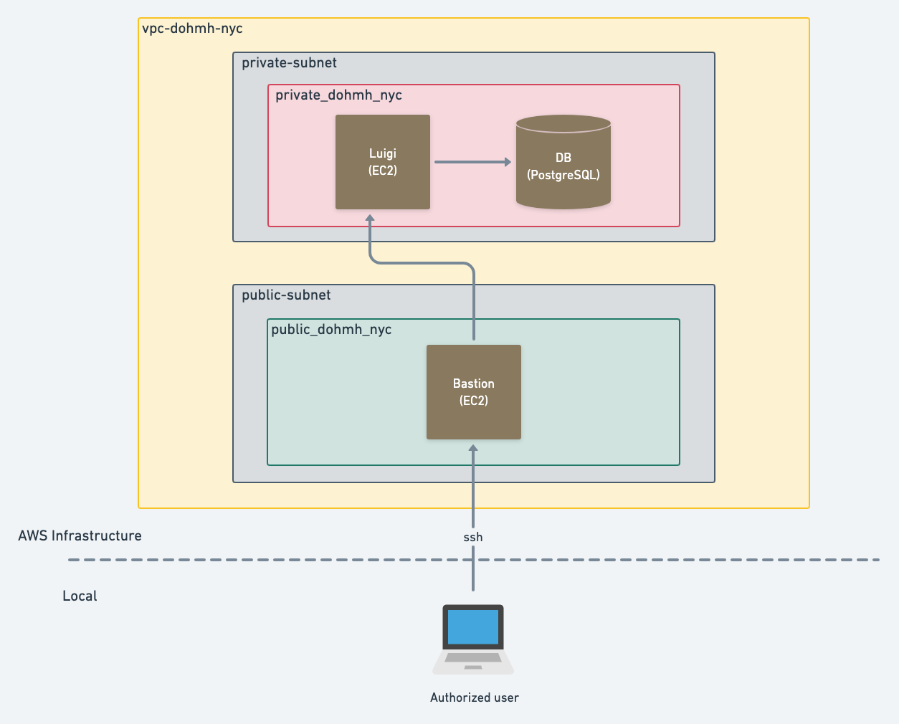

# Arquitectura de productos de datos - ITAM 2020

# NYC Open Data: DOHMH Childcare Center Inspections

En la ciudad de Nueva York se realizan inspecciones diarias en días hábiles a los 2,807 centros de cuidado infantil que hay en la ciudad. Del total de inspecciones realizadas, a partir del abril del año 2017 y hasta el día de hoy, aproximadamente el 60% tiene algún tipo de violación. De los centros con violaciones, 51% son del tipo general, 35% críticas y 14% son un peligro para salud pública. Por lo tanto, es de vital importancia identificar cuáles centros son más propensos a cometer una violación de salud pública para llegar a inspeccionarlos en el menor tiempo posible. 

Si se tuviera suficientes inspectores para visitar todos los centros diariamente, este problea no existiría pero, dado que solamente hay un número limitado de inspectores, se diseñará e implementará un modelo predictivo que permita identificar a los centro de cuidados infantiles con mayor probabilidad de cometer una violación del tipo "peligro par ala salud pública".

El set de datos que se utilizó se encuentra en la plataforma [NYC Open Data](https://dev.socrata.com/foundry/data.cityofnewyork.us/dsg6-ifza). 

## Objetivo

El objetivo del proyecto es realizar un modelo predictivo que permita identificar a los centro de cuidados infantiles con mayor probabilidad de cometer una violación del tipo "peligro par ala salud pública".

## Datos

El set de datos que se utilizó se encuentra en la plataforma [NYC Open Data](https://dev.socrata.com/foundry/data.cityofnewyork.us/dsg6-ifza) y contiene una lista de todas las inspecciones que se realizaron a partir de abril del 2017 y hasta el día de hoy (28 de abril del 2020). La base de datos se actualiza de manera diaria y contiene 34 vairbales con 52,023 observaciones incluyendo observaciones duplicadas. Si se elimina las observaciones duplicadas, hay 39,371 inspecciones.

Las variables pueden clasificarse en los siguientes rubros:

No obstante, de la base original, nosotros solamente utilizamos las siguientes variables. Las demás variables utilizadas en nuestro modelo fueron creadas y su descripción puede encontrar en:

## Creación de arquitectura en la nube

### Prerrequisitos

[Instalar jq](https://stedolan.github.io/jq/download/)

[Instalar python 3.6+](https://www.python.org/downloads/)

[Instalar AWS CLI](https://docs.aws.amazon.com/cli/latest/userguide/cli-chap-getting-set-up.html)

[Instalar Boto3 library](https://pypi.org/project/boto3/)

[Configurar tus credenciales de AWS](https://docs.aws.amazon.com/cli/latest/userguide/cli-chap-configure.html)

### Configuración

1) Posiciónate en el directorio /config
2) Corre el script ./run.sh

El script crea toda la arquitectura necesaria en AWS para realizar las operaciones de ETL y predicción. 

## Extracción y carga de los datos

El set de datos que utilizamos se encuentra en un API REST en la plataforma [NYC Open Data](https://dev.socrata.com/foundry/data.cityofnewyork.us/dsg6-ifza), que permite descargar los datos en formato `csv`, `xml` y `json`.

> Se decidió utilizar el formato `json` para evitar conflictos con comas, comillas dobles, o cualquier otro error de <em>parseo</em> que pudiera surgir si utilizáramos `csv`. (`xml` no estaba en la jugada).

La **extracción** y **carga** (<em>extract</em> y <em>loading</em>) de los datos se detalla a continuación.

### Cron con Luigi
Los datos de DOHMH Childcare Center Inspections se actualizan diaramente. Esto nos permite automatizar fácilemente el proceso de extracción, transformación y carga de datos. 

Dado que usaremos un servidor Ubuntu, podemos hacer uso de [Cron](https://en.wikipedia.org/wiki/Cron), el <em>job scheduler</em> por excelencia de sistemas UNIX. 

La rutina que programemos en Cron ejecutará un script de Python que realice lo siguiente:
1. Extrear los nuevos datos del endpoint del API.
2. Ejecutar los `INSERTS` en nuestro esquema de Postgres
3. Enviar notificación por correo a nuestro equipo cuando el script haya finalizado.

Nuestro `crontab` lucirá de la siguiente manera:

**Nota: Los nombres de archivos y directorios no son finales.**

**Contenido de nuestroo `crontab`**
~~~
MAILTO=miembros-equipo-5@dpa-itam-2020.com
0 10 * * * python3 /home/ubuntu/scripts/etl/execute.sh
~~~

### ETL con Luigi
El ETL está en [este otro repositorio](https://github.com/dpa-2020-equipo-5/nyc-ccci-etl) para tratarlo como una unidad <em>deployable</em> independiente.

Para ejeuctar el orquestador:

~~~~bash
ssh usuario@18.208.188.16
/home/ubuntu/nyc-ccci-etl/bin/run 2020 01 01
~~~~

El comando anterior ejecuta el script `run` con los argumentos 2020, 01 y 01. El run.sh se ve así:

~~~~bash
cd /home/ubuntu/nyc-ccci-etl
PYTHONPATH='.' luigi --module nyc_ccci_etl.luigi_tasks.load_task LoadTask --year=$1 --month=$2 --day=$3  --local-scheduler
~~~~

TODO: Orquestar con CRON

## Linaje de datos

El proceso de limpieza de datos y creación de varibles es el siguiente:

* Tabla 1 (Raw): Es la base de datos como se extrajo de la API.
* Tabla 2 (Clean): Es la base original pero limpia: 1. sin observaciones duplicadas, 2. sin espacios extras, 3. con el texto en minúsculas. El script correspondiente se llama clean.py
* Tabla 3 (Centros-estática): Contiene toda la información estática sobre los 2,989 centros registrados. Es decir, desde `center_name` hasta `avg_critical_violation_rate`.
    * Tabla 3.1 (Centros-estática-processed): Es el output de la tabla 3 después de correr el script centros_estática_proc.py
* Tabla 4 (Inspecciones-dinámicas): Contiene todas las inspecciones realizadas desde el 26 de mayo del 2016 al día de hoy.
    * Tabla 4.1 (Inspecciones-dinámicas-processed): Es el output de la tabla 4 después de correr el script inspecciones-dinámicas_proc.py
* Tabla 5 (Centros-inspecciones-modelado): Contiene la información conjunta de los centros y de las inspecciones que se va a ocupar en el modelo final. El script correspondiente se llama modelado.py
    
 **ACTUALIZAR TABLA**

## Feature engineering 

#### Tabla 3.1: 

El feature engineering que se le aplicó a la Tabla 3 (Centros-estática) consistió en los siguientes pasos:

* Usar las 28 variables originales de la Tabla2 que fueron seleccionadas para la Tabla3. Es decir, desde `center_name` hasta `avg_critical_violation_rate`. 
* Categorizar las variables:  `borough`,`program_type` y `facility_type`.
* Conservar únicamente las variables estáticas que se utilizarán en el modelo: `daycareid`, `maximum_capacity`, `violation_rate_percent`, `total_educational_workers`, `public_health_hazard_violation_rate`, `critical_violation_rate` y las 
13 dummies creadas que corresponden a la categorización de las variables `borough`,`program_type`, `facility_type`,

#### Tabla 4.1: 

El feature engineering que se le aplicó a la Tabla 4 (Inpecciones-dinámicas) consistió en los siguientes pasos:

* Conservar únicamente las variables que aportaban información sobre las inspecciones de la Tabla 2 (con la excepeción de borough): `daycareid`, `inspection_date`, `inspection_summary`, `violation_category` y `borough`.
* Separar la variable de `inspecion_summary` en 3 variables: `reason`, `result1` y `result2`. 
* Tirar todas las observaciones que representaran inspecciones que no fueran de primera vez (revisiones subsecuentes y especiales). Es decir, que en la variable de reason dijera "initial annual inspection". 
* Borrar la vairble `reason` pues todas son iguales. Por ahora, borrar `result1` y `result2`, si vemos que se necesitan para predecir, hay que hacerlas categóricas y meterlas al modelo.
* Tirar las observaciones de los días no hábiles: sábado y domingo. Esto porque hay muy pocas y no son inspecciones rutinarias.
* Rellenar con NA las celdas vacías de violation_category'.
* Ordenar la base por `childcare_id` y por `year`, `month` y `day` en orden descendiente.
* Cración de variables:
  * `year`: Año de la inspección.
  * `month`: Mes de la inspección.
  * `day`: Día de la inspección.
  * `violacion`: Dummy =1 si huvo violación.
  * `public_hazard`: Dummy =1 si hubo violación y es un problema de salud pública.
  * `ultima_inspección`: Días que han pasado desde la última inspección anual.
  * `violaciones_hist_salud_publica`: Número de violaciones de salud pública históricas (2017-2019) por centro. 
  * `violaciones_2019_salud_publica`: Número de violaciones de salud pública en el 2019 por centro.
  * `violaciones_hist_criticas`: Número de violaciones críticas históricas anteriores (2017-2019) por centro.
  * `violaciones_2019_criticas`: Número de violaciones críticas en el 2019 por centro.
  * `ratio_violaciones_hist`: Número de inspecciones en total de primera vez que resultaron en violación crítica o de salud 
                              pública/ número de inspecciones de primera vez por centro.
  * `ratio_violaciones_2019`: Número de inspecciones en total de primera vez que resultaron en violación crítica o de salud 
                              pública en el 2019/ número de inspecciones de primera vez por centro.
  * `prom_violaciones_hist_borough`: Promedio de violaciones históricas por distrito.
  * `prom_violaciones_2019_borough`: Promedio de violaciones en el 2019 por distrito.
  * `ratio_violaciones_hist_sp`: Número de violaciones de salud pública de primera vez por centro históricas (2017-2019)/ 
                                      número de violaciones de primera vez de todo tipo por centro históricas (2017-2019) .
  * `ratio_violaciones_2019_sp`: Número de violaciones de salud pública de primera vez por centro en el 2019 / número de   
                                 violaciones de primera vez de todo tipo por centro en el 2019 .
  * `ratio_violaciones_hist_criticas`: Número de violaciones críticas de primera vez por centro históricas (2017-2019)/ 
                                      número de violaciones de primera vez de todo tipo por centro históricas (2017-2019).
  * `ratio_violaciones_2019_criticas`: Número de violaciones críticas de primera vez por centro en el 2019/ número de 
                                       violaciones de primera vez de todo tipo por centro en el 2019.
## Modelado

La varible binaria dependiente es `public_hazard` pues queremos predecir cuáles centros tienen mayor probabilidad de cometer una violación de salud pública.

Se utilizó la Tabla 5 que junta las variables de la Tabla 3.1 y 4.1.

Para el entrenamiento se usaron todos los datos del 2017-2019 y para validación los datos correspondientes a lo que va del añ
o 2020.

Se corrieorn dos modelos:

 - Randon forest.
 - XGboost
 
## Tablas de metadatos

Los metadatos generados en cada paso son:

## Implicaciones éticas
