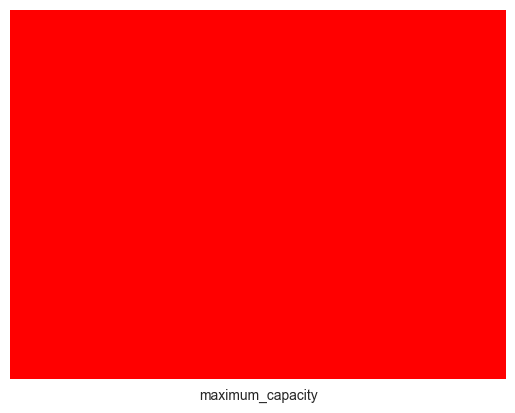
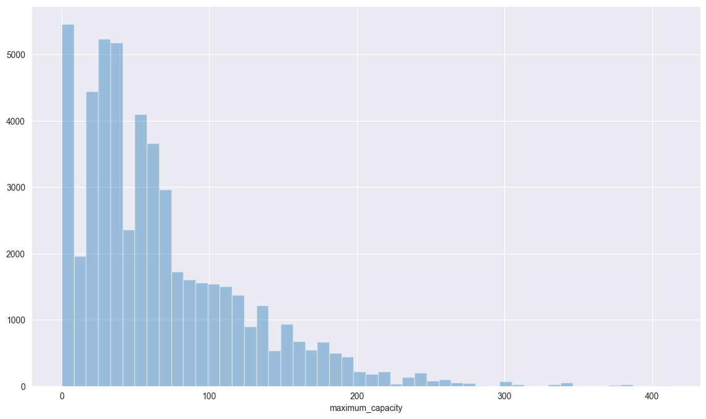
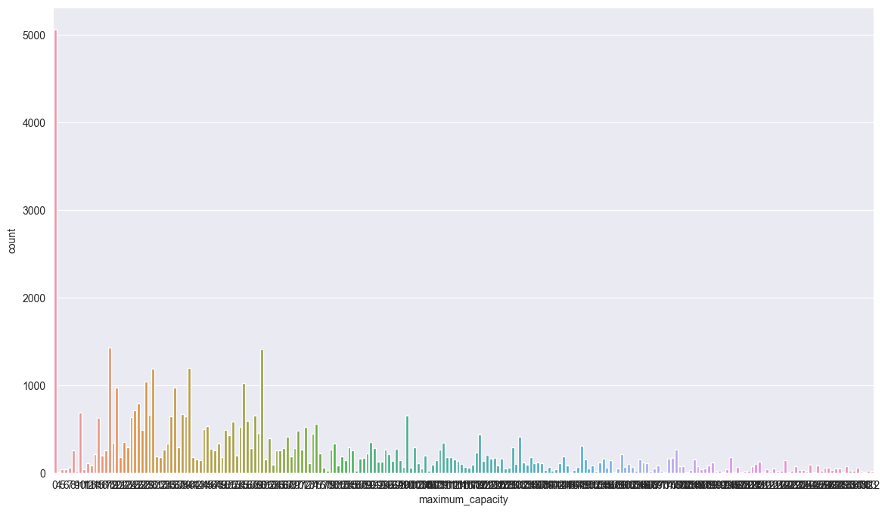
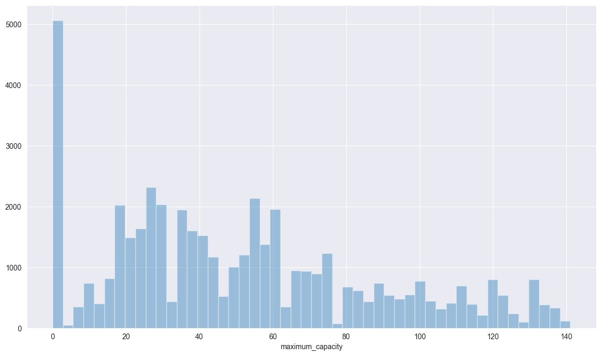
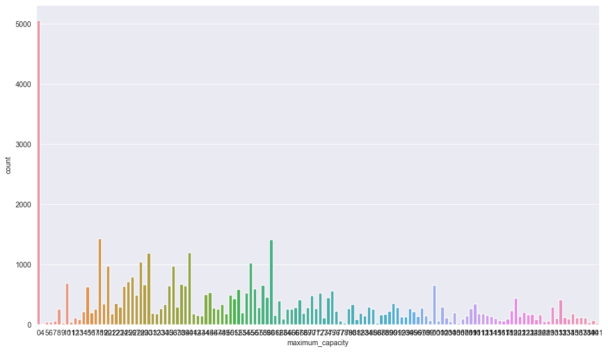
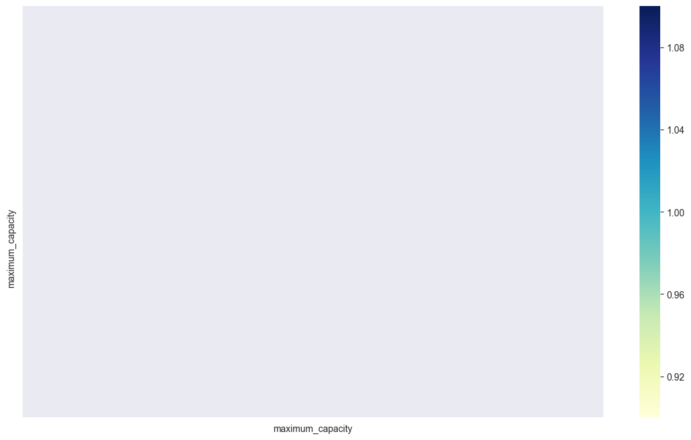
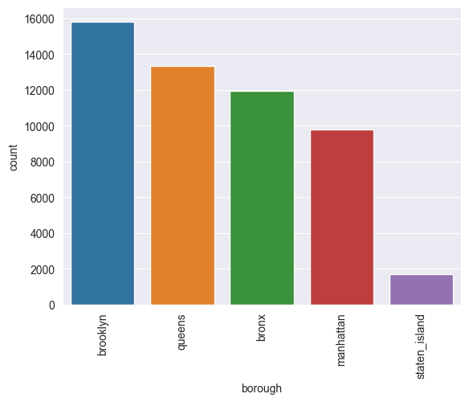
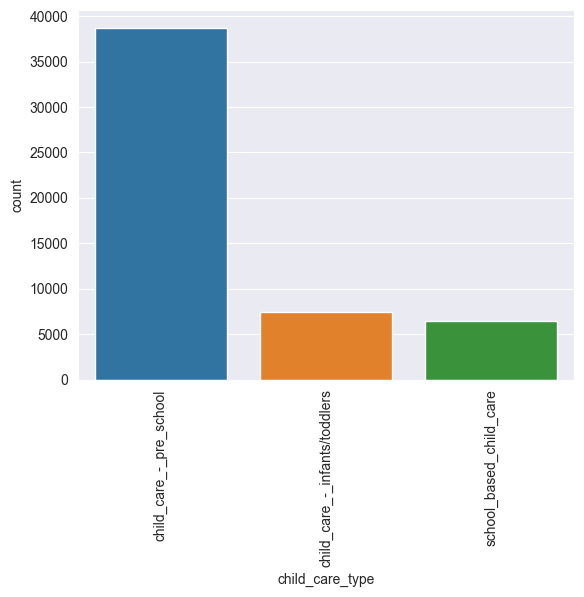
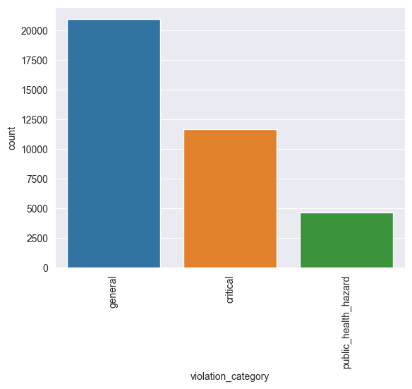

# ChildcareCenters

## Data Profiling

##### 16/03/2020

---

## 1. Variables

10 variables

- center_name
- borough
- zipcode
- phone
- maximum_capacity
- child_care_type
- url
- inspection_date
- regulation_summary
- violation_category

### 1.1. Variables numéricas

1 variables numéricas

- maximum_capacity

### 1.2. Variables categóricas

9 variables categóricas

- center_name
- borough
- zipcode
- phone
- child_care_type
- url
- inspection_date
- regulation_summary
- violation_category

### 1.2. Variables de fecha

0 variables de fecha

### 1.3. Dimensión

Filas: 52570, Columnas: 10

### 1.4. Observaciones únicas

39005

### 1.5. Resumen de variables

#### 1.5.1. Variables numéricas

#### Observaciones

|                         |   maximum_capacity |
|-------------------------|--------------------|
| Número de observaciones |           52570    |
| Valores únicos          |             226    |
| % Únicos                |               0.43 |
| Valores faltantes       |               0    |
| % Faltantes             |               0    |

#### Centralización

|         |   maximum_capacity |
|---------|--------------------|
| media   |            66.1828 |
| mediana |            53      |
| moda    |             0      |

#### Posición

|     |   maximum_capacity |
|-----|--------------------|
| max |                412 |
| 75% |                 94 |
| 50% |                 53 |
| 25% |                 26 |
| min |                  0 |

#### Dispersión

|            |   maximum_capacity |
|------------|--------------------|
| desv. est. |            56.3254 |
| varianza   |          3172.55   |
| rango      |           412      |

#### Forma

|           |   maximum_capacity |
|-----------|--------------------|
| asimetria |            1.39256 |
| kurtosis  |            2.51283 |

#### Valores repetidos

|                    |   maximum_capacity |
|--------------------|--------------------|
| valor 1            |                  0 |
| frecuencia valor 1 |               5060 |
| valor 2            |                 18 |
| frecuencia valor 2 |               1426 |
| valor 3            |                 60 |
| frecuencia valor 3 |               1409 |
| valor 4            |                 40 |
| frecuencia valor 4 |               1198 |
| valor 5            |                 30 |
| frecuencia valor 5 |               1184 |

##### 1.5.1.2. Posibles redondeos

| variable         |   value |   frequency |   repetition_rate |
|------------------|---------|-------------|-------------------|
| maximum_capacity |       0 |        5060 |              0.1  |
| maximum_capacity |      18 |        1426 |              0.03 |
| maximum_capacity |      60 |        1409 |              0.03 |

##### 1.5.5.3. Gráfica de valores faltantes

##### 1.5.4. Distrubuciones

##### 1.5.4.1. maximum_capacity

##### 1.5.4.2. maximum_capacity

##### 1.5.4.3. maximum_capacity sin outliers

##### 1.5.4.4. maximum_capacity sin outliers

##### 1.5.5. Matriz de correlación

#### 1.5.2. Resumen de variables categóricas

#### Observaciones

|                         |   center_name |   borough |   zipcode |    phone |   child_care_type |      url |   inspection_date |   regulation_summary |   violation_category |
|-------------------------|---------------|-----------|-----------|----------|-------------------|----------|-------------------|----------------------|----------------------|
| Número de observaciones |         52570 |     52570 |  52521    | 52496    |             52570 | 25589    |          52524    |             52524    |             37246    |
| Número de categorias    |          2115 |         5 |    179    |  2129    |                 3 |   842    |            752    |               426    |                 3    |
| Valores únicos          |          2115 |         5 |    179    |  2129    |                 3 |   842    |            752    |               426    |                 3    |
| Valores únicos (%)      |           100 |       100 |    100    |   100    |               100 |   100    |            100    |               100    |               100    |
| Valores faltantes       |             0 |         0 |     49    |    74    |                 0 | 26981    |             46    |                46    |             15324    |
| Valores faltantes (%)   |             0 |         0 |      0.09 |     0.14 |                 0 |    51.32 |              0.09 |                 0.09 |                29.15 |

#### Categorías

|            |   center_name |   borough |   zipcode |   phone |   child_care_type |   url |   inspection_date |   regulation_summary |   violation_category |
|------------|---------------|-----------|-----------|---------|-------------------|-------|-------------------|----------------------|----------------------|
| Categorías |             0 |         0 |         0 |       0 |                 0 |     0 |                 0 |                    0 |                    0 |

#### Valores repetidos

|                    | center_name                            | borough       |   zipcode | phone        | child_care_type               | url                      | inspection_date   | regulation_summary                                                                                                                                                                                                                          | violation_category   |
|--------------------|----------------------------------------|---------------|-----------|--------------|-------------------------------|--------------------------|-------------------|---------------------------------------------------------------------------------------------------------------------------------------------------------------------------------------------------------------------------------------------|----------------------|
| valor 1            | bright_horizons_children's_centers_llc | brooklyn      |     10466 | 718-723-3967 | child_care_-_pre_school       | www.archny.org/education | 05/09/2018        | there_were_no_new_violations_observed_at_the_time_of_this_inspection/visit.                                                                                                                                                                 | general              |
| frecuencia valor 1 | 299                                    | 15820         |      1035 | 223          | 38746                         | 1027                     | 255               | 15278                                                                                                                                                                                                                                       | 20925                |
| valor 2            | cardinal_mccloskey_community_services  | queens        |     11219 | 718-215-4125 | child_care_-_infants/toddlers | www.brighthorizons.com   | 03/04/2020        | staff_failed_to_obtain_proof_of_immunization;_except_for_exempt_staff,_required_staff_immunizations_were_not_submitted_to_child_care_service;_records_not_confidential.                                                                     | critical             |
| frecuencia valor 2 | 273                                    | 13345         |       907 | 193          | 7389                          | 529                      | 248               | 5943                                                                                                                                                                                                                                        | 11662                |
| valor 3            | the_children's_aid_society             | bronx         |     10461 | 718-484-8777 | school_based_child_care       | www.sunshinenewyork.com  | 02/14/2018        | at_time_of_inspection_floors/walls_ceilings_were_observed_not_maintained;_in_disrepair_or_covered_in_a_toxic_finish.                                                                                                                        | public_health_hazard |
| frecuencia valor 3 | 268                                    | 11942         |       898 | 193          | 6435                          | 310                      | 224               | 2046                                                                                                                                                                                                                                        | 4659                 |
| valor 4            | northeast_bronx_day_care_center,_inc.  | manhattan     |     10467 | 718-239-1062 | 0                             | fochdaycare.org          | 03/13/2019        | at_time_of_inspection_it_was_determined_that_child_care_service_allows_staff_to_perform_their_duties_that_are_not_healthy_or_are_incapable_of_carrying_out_their_duties._staff_medical_clearances_are_not_maintained_by_child_care_service. | 0                    |
| frecuencia valor 4 | 265                                    | 9775          |       896 | 184          | 0                             | 275                      | 207               | 1921                                                                                                                                                                                                                                        | 0                    |
| valor 5            | the_learning_experience                | staten_island |     10456 | 347-730-5438 | 0                             | www.tendertotsny.com     | 02/08/2018        | at_time_of_inspection_it_was_determined_that_child_care_service_failed_to_ensure_staff_received_required_training_within_time_frames_and/or_failed_to_maintain_training_records.                                                            | 0                    |
| frecuencia valor 5 | 247                                    | 1688          |       816 | 184          | 0                             | 274                      | 205               | 1439                                                                                                                                                                                                                                        | 0                    |

#### 1.5.2.2. Gráficas de frecuencias

##### 1.5.2.2.1. borough

##### 1.5.2.2.2. child_care_type

##### 1.5.2.2.3. violation_category

