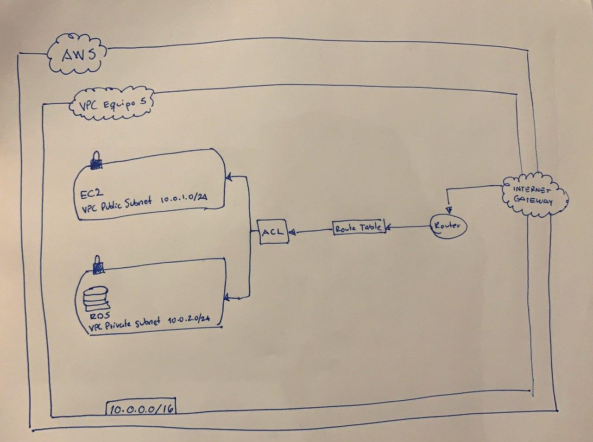
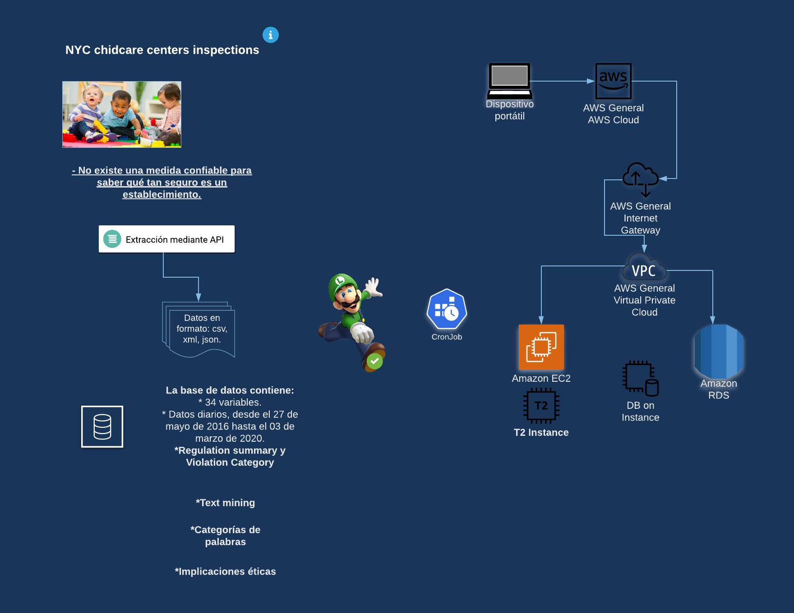

# NYC Childcare Centers Inspections ETL

## Para ejecutar...

1. Editar nombre del archivo `settings.ini.example` a `settings.ini`
2. Agregar credenciales y variables de entorno a `settings.ini`
3. Agregar permisos de ejecución a bin/run
~~~~bash
chmod +x bin/run
~~~~
4. Ejecutar con parámetro de año, mes y día:
~~~~bash
bin/run 2020 3 2
~~~~

> Esto ejecutará el orquestador que descarga los datos del 2 de marzo de 2020

---

### Diagrama de architectura 1

### Diagrama de architectura 2

---

### Conexión a RDS
Nuestra instancia de RDS es accesible únicamente a través del EC2 que está en nuestra VPC.

### Consideraciones importantes en el código

Separamos la lógica del ETL de la lógica de Luigi. Esto nos permitirá escalar y testear el código con mayor facilidad.

